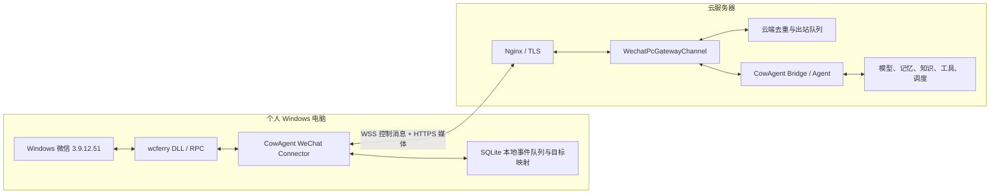
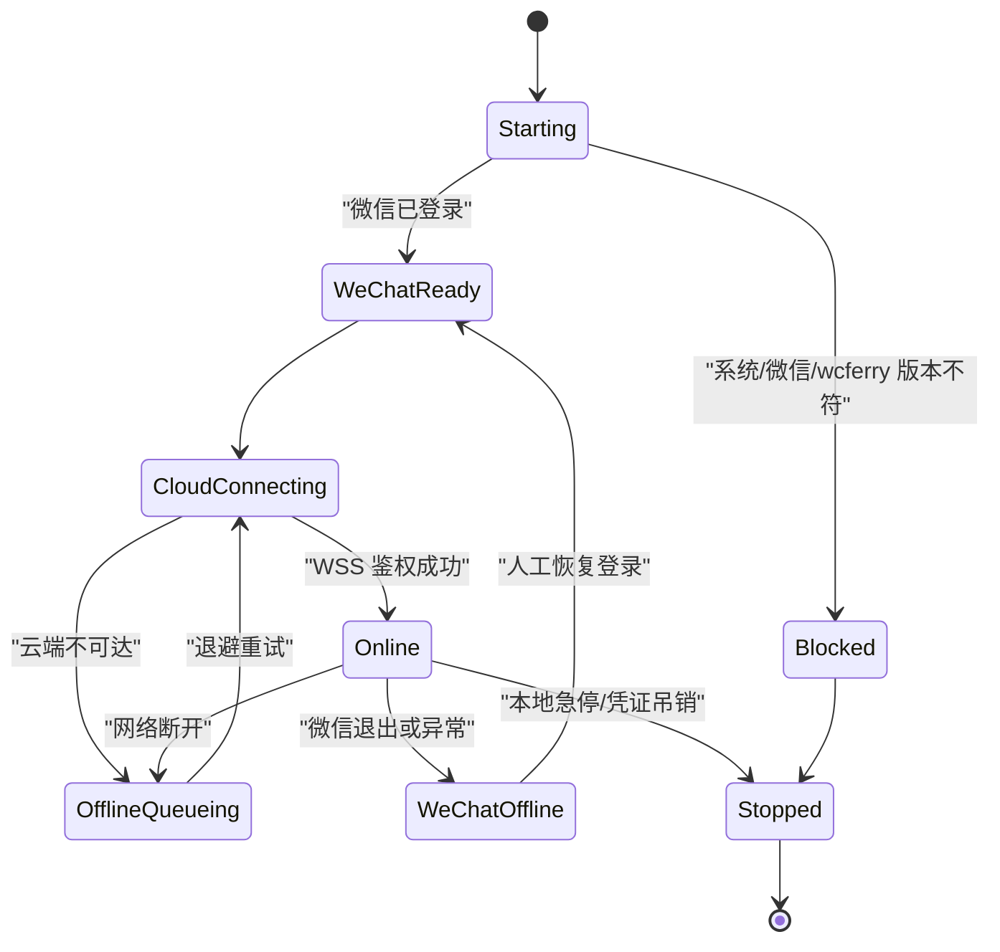

# Bubblebot 个人微信能力整合到 CowAgent 的方案

> 推荐架构：**Windows 本地微信连接器 + 云服务器 CowAgent**。本地只负责微信客户端操作、权限过滤和可靠转发；云端负责 Agent、模型、记忆、知识库、工具与调度。
>
> 审阅基线：CowAgent `a87207a7a44ab13aff42ea05c27e8165dc217bc7`；Bubblebot `818d78166a8cb93985e2e1bed4a3c51b38b9c2d4`（2026-08-05）
>
> 外部项目：[Bubblebot](https://github.com/Zippland/Bubblebot)、[WeChatFerry](https://github.com/lich0821/WeChatFerry)

## 1. 目标与结论

Bubblebot 可以通过 `wcferry` 接入 Windows PC 微信客户端当前登录的真实个人账号，读取该账号收到的私聊、群聊和多媒体消息，并以该账号身份发送文本、图片与文件。

由于 `wcferry` 只能在 Windows 微信客户端所在电脑运行，而 CowAgent 更适合部署在稳定在线的云服务器，因此推荐将系统拆成两个独立组件：

1. **本地 Windows 微信连接器**：连接微信、过滤消息、下载媒体、维护本地可靠队列，并主动连接云端。
2. **云端 CowAgent 微信网关渠道**：接收标准化微信事件，接入 CowAgent 的 `ChatChannel -> Bridge -> Agent` 链路，再将回复指令发回本地。

本地连接器不运行模型、Agent、记忆或系统工具；云端 CowAgent 不加载 wcferry、不访问本地微信数据库，也不能任意控制个人电脑。

该方案技术上可行，且比让 CowAgent 与微信客户端同机运行更适合长期部署。但它仍依赖非官方微信 Hook 技术，应作为 Windows 专用、默认关闭的实验能力，不替换 CowAgent 现有官方 `weixin` 通道。

## 2. 两种个人微信接入的区别

| 维度 | CowAgent 现有 `weixin` | Bubblebot / wcferry 远程连接器 |
| --- | --- | --- |
| 接入方式 | 微信官方 iLink Bot API | Hook Windows 微信客户端，通过 RPC 操作 |
| 用户看到的身份 | 会话列表中新增机器人联系人 | 当前 PC 微信登录的本人账号 |
| 联系人私聊 | 只能处理用户与机器人之间的会话 | 可处理真实账号收到的私聊 |
| 群聊 | 当前实现不支持 | 支持，推荐只在被 @ 时触发 |
| CowAgent 部署位置 | 任意常见服务器环境 | CowAgent 在云端；wcferry 只在本地 Windows |
| 本地网络要求 | 无 | 只需允许本地主动访问云端 HTTPS/WSS 443 |
| 微信客户端要求 | 手机微信 8.0.69+ | 指定版本 Windows PC 微信并保持登录 |
| 稳定性与风险 | 官方 API，相对稳定 | 与客户端版本强耦合，存在兼容和账号风控风险 |

因此：

- 只需要“通过个人微信和 CowAgent 对话”时，优先使用现有 `weixin`。
- 需要“让 CowAgent 代表本人读取联系人/群消息并回复”时，才使用本方案。

## 3. Bubblebot 代码依据

Bubblebot 的微信实现位于 `bubbles/channels/wechat.py` 和 `bubbles/channels/wechat_app.py`：

1. `Wcf()` 连接本机 Windows 微信客户端，`get_self_wxid()` 获取当前账号。
2. `query_sql("MicroMsg.db", ...)` 读取联系人昵称、微信号和备注名，并使用 TTL 刷新。
3. `enable_receiving_msg()` + `get_msg()` 从本地消息队列持续接收微信消息。
4. `msg.from_self()` 过滤自己发送的消息；`msg.from_group()`、`msg.is_at()` 判断群聊与 @。
5. 文本、图片、语音、视频、文件、链接和引用消息被解析为统一入站事件。
6. `send_text()`、`send_image()`、`send_file()` 以当前微信账号发送消息。
7. `groups` 和 `allow_from` 可以限制来源，但 Bubblebot 中空列表的语义是允许全部，不能直接作为本方案的安全默认值。

Bubblebot 固定依赖 `wcferry==39.5.1.0`。WeChatFerry 的版本说明表明 39.5 系列适配 Windows 微信 `3.9.12.51`，wcferry 与 PC 微信版本必须严格匹配。

Bubblebot 对微信的自动测试主要覆盖 @ 转换和日志桥接，没有覆盖真实客户端登录、完整收发、媒体下载、网络断开与进程恢复。现有代码可以证明能力存在，但不能直接视为生产级远程网关。

## 4. 外部约束与风险

### 4.1 平台与运行方式

- wcferry 只在 Windows 微信客户端所在电脑运行，不能直接装进普通 Linux CowAgent 容器。
- Windows 微信需要保持登录；电脑睡眠、关机或退出微信时，个人微信通道离线，但云端 CowAgent 其他通道不受影响。
- 连接器应在已登录的 Windows 用户会话内运行。不要优先做成 Windows Session 0 系统服务，因为它可能无法访问当前桌面用户的微信进程；推荐使用托盘程序或“用户登录时启动”的计划任务。
- 本地电脑不需要公网 IP，也不开放任何入站端口。连接器只主动访问云端 `wss://` 和 `https://`。
- WeChatFerry 上游仓库已于 2026-07-10 归档为只读，微信升级造成的兼容问题不能依赖上游及时修复。

### 4.2 合规与许可证

- Bubblebot 本身采用 MIT License。
- WeChatFerry 仓库显示 MIT License，但其随项目和 wheel 分发的免责声明将用途限定为合法的学习、研究和非商业用途，并要求二次开发者自行承担责任。
- 若 CowAgent 的发行、托管或企业服务涉及商业使用，必须先完成许可证与法律评估。
- 在评估完成前，不应把 wcferry DLL 放入 CowAgent 默认安装包、云端镜像或商业下载渠道；本地连接器应保持为独立、可选安装包。
- UI 和文档必须明确说明该能力不是微信官方开放 API，并提示版本、账号和隐私风险。

### 4.3 账号与隐私

本地连接器可以读取真实联系人消息、微信数据库和媒体附件，权限明显高于官方 `weixin` 通道。主要风险包括：

- 微信风控、限制登录或封号。
- 错误回复真实联系人或群聊，造成不可逆的外部影响。
- 私聊、群聊和附件被传到云服务器及模型供应商。
- 所有联系人都能触发带有终端、文件和浏览器权限的 CowAgent。
- 网络重试造成重复回复。
- 云端凭证泄露后，攻击者伪造下发消息指令。

本方案必须采用本地与云端双重白名单、独立低权限 Agent、设备凭证、发送限流、幂等键和本地一键停用。

## 5. 推荐总体架构

### 5.1 组件关系



### 5.2 责任边界

| 能力 | 本地连接器 | 云端 CowAgent |
| --- | --- | --- |
| 连接和操作 Windows 微信 | 是 | 否 |
| 微信版本检测 | 是 | 只展示状态 |
| 联系人/群白名单第一层过滤 | 是 | 是，第二层校验 |
| 消息解析与媒体解密 | 是 | 只处理标准化事件 |
| Agent 推理、记忆、知识库 | 否 | 是 |
| 终端、浏览器、MCP、Skill | 否 | 是，建议低权限配置 |
| 微信发送动作 | 执行 | 只生成受限发送命令 |
| 设备认证与吊销 | 保存设备凭证 | 签发、轮换、吊销 |
| 消息可靠队列 | 入站和执行结果 | 去重与出站命令 |

### 5.3 为什么使用本地主动 WSS

推荐本地连接器主动建立 `wss://<cowagent-domain>/gateway/wechat-pc` 长连接：

- 本地不需要公网 IP、端口映射、DDNS 或内网穿透。
- 云端可通过标准 443 端口和 Nginx 统一终止 TLS。
- 同一连接可同时承载入站消息、回复指令、ACK、心跳和状态变化。
- 延迟明显低于周期轮询。
- 断线后可以通过指数退避自动重连并补发本地未确认事件。

不建议云端主动连接个人电脑，也不建议让云端获得远程桌面、Shell 或任意 wcferry RPC 权限。

## 6. 本地 Windows 连接器设计

### 6.1 代码组织

建议将本地程序作为独立可选组件放在 CowAgent 仓库的 `connectors/` 下，并能够单独打包发布：

```text
connectors/wechat_pc/
├── pyproject.toml
├── README.md
├── cowagent_wechat_connector/
│   ├── main.py                 # CLI / 托盘程序入口
│   ├── service.py              # 生命周期和状态机
│   ├── wcf_adapter.py          # Wcf/WxMsg 最小封装
│   ├── message_parser.py       # 微信消息标准化
│   ├── app_message.py          # 文件、链接、引用、小程序解析
│   ├── contacts.py             # 联系人和群成员缓存
│   ├── policy.py               # 本地白名单与群聊触发
│   ├── transport.py            # WSS、重连、心跳和 ACK
│   ├── media.py                # 媒体下载、校验和上传
│   ├── spool.py                # SQLite 入站队列、命令账本
│   ├── identity.py             # peer_key / conversation_key 映射
│   └── config.py
└── tests/
```

连接器不依赖 CowAgent 的模型 SDK、Agent、MCP、插件或工作空间，避免 Windows 端重复维护整套服务。

### 6.2 本地状态机



### 6.3 本地处理顺序

1. 检查 Windows、Python、微信和 wcferry 版本。
2. 初始化 `Wcf()` 并确认微信已登录。
3. 读取本人账号和联系人缓存，建立不暴露原始 wxid 的本地目标映射。
4. 启用收消息队列。
5. 收到消息后先过滤本人消息、重复消息、非白名单联系人和非白名单群。
6. 群聊仅在被 @ 时继续处理。
7. 将允许消息写入本地 SQLite outbox 后再发送到云端。
8. 媒体在本地解密、检查大小/MIME/扩展名和哈希后上传。
9. 云端确认事件已持久化后，本地才将 outbox 项标记完成。
10. 收到云端发送命令时再次校验目标白名单，执行 wcferry 发送，并上报结果。

### 6.4 隐私化身份

不建议将完整联系人表或原始 wxid 批量上传到云端。推荐本地维护：

- `account_key = HMAC(device_secret, self_wxid)`。
- `peer_key = HMAC(device_secret, contact_wxid)`。
- `conversation_key = HMAC(device_secret, wxid_or_roomid)`。
- 本地 SQLite 保存 `peer_key/conversation_key -> 原始 wxid/roomid` 映射。
- 云端只保存 opaque key、用户允许上传的显示名和必要会话元数据。
- 群成员 @ 使用 `member_key`，下发到本地后再解析成真实 wxid 和 `aters`。

首个封闭原型可以在 TLS 内使用原始 wxid 方便调试，但发布版本应使用 opaque key。

## 7. 云端 CowAgent 网关渠道设计

### 7.1 代码组织

云端新增一个名为 `wechat_pc` 的渠道，但它不直接导入 wcferry，而是管理远程连接器：

```text
channel/wechat_pc/
├── __init__.py
├── wechat_pc_channel.py       # ChatChannel 子类、入站 produce、出站 send
├── wechat_pc_message.py       # 远程事件 -> ChatMessage
├── gateway_server.py          # asyncio WebSocket 服务
├── connection_registry.py     # device/account -> 活跃连接
├── protocol.py                # v1 消息校验、序列化和版本协商
├── device_store.py            # 配对、凭证哈希、吊销和最近在线
├── outbox_store.py            # 云端待发送命令与结果
├── media_store.py             # 上传、下载、TTL 和哈希校验
└── README.md
```

### 7.2 与 CowAgent 的接入

`WechatPcChannel` 继承 `ChatChannel`：

1. `gateway_server` 接收并校验 `message.in`。
2. 转换为 `WechatPcMessage`，填充 `ChatMessage` 标准字段。
3. 根据 `device_id + account_key + conversation_key` 生成稳定会话。
4. 调用 `_compose_context()` 和 `produce()` 进入 CowAgent 队列。
5. `Bridge -> Agent` 完成推理、记忆和工具调用。
6. `send(reply, context)` 将回复转换为 `command.send`，写入云端 outbox。
7. 若设备在线，通过 WSS 下发；设备离线时按配置等待或失败。
8. 本地执行后回传 `command.result`，云端更新最终状态。

`ChatChannel` 的回复处理运行在线程池，而 WSS 通常运行在 asyncio 事件循环中。实现时必须使用线程安全队列或 `asyncio.run_coroutine_threadsafe()` 把发送命令交回网关事件循环，不能从工作线程直接操作 WebSocket 对象。

### 7.3 会话与接收者标识

推荐：

```text
session_id = wechat_pc:{device_id}:{account_key}:{conversation_key}
receiver   = wechat-pc://{device_id}/{account_key}/{conversation_key}
channel_type = wechat_pc
```

- 私聊的 `conversation_key` 对应联系人 wxid 的本地映射。
- 群聊的 `conversation_key` 对应 roomid 的本地映射。
- `receiver` 使用稳定 URI，供调度器和主动发送保存；解析后仍必须检查设备、账号和目标授权。
- 多台电脑或多个微信账号不会因为相同昵称而串会话。

## 8. 通信协议

### 8.1 协议原则

- WebSocket 只承载 JSON 控制消息和小文本；大媒体走 HTTPS。
- 所有消息包含协议版本、唯一 ID、时间戳、设备、账号和幂等键。
- 云端只接受已配对且未吊销的设备。
- 入站采用“至少一次传输 + 云端去重”；出站采用命令账本避免正常重连重复执行。
- 协议版本不兼容时明确拒绝连接，不静默降级。

统一信封示例：

```json
{
  "protocol": "cow.wechat-pc.v1",
  "type": "message.in",
  "id": "evt_01J...",
  "timestamp": 1786022400000,
  "device_id": "dev_01J...",
  "account_key": "acct_f3c...",
  "payload": {}
}
```

### 8.2 消息类型

| 类型 | 方向 | 用途 |
| --- | --- | --- |
| `hello` | 本地 → 云端 | 版本、设备、账号、微信状态和能力协商 |
| `hello.ack` | 云端 → 本地 | 鉴权结果、服务时间和策略版本 |
| `heartbeat` / `heartbeat.ack` | 双向 | 在线检测和时钟偏差 |
| `message.in` | 本地 → 云端 | 标准化微信入站消息 |
| `message.ack` | 云端 → 本地 | 表示事件已校验并持久化，不代表 Agent 已回复 |
| `presence.update` | 本地 → 云端 | 微信登录、版本、连接器状态 |
| `command.send` | 云端 → 本地 | 受限的文本/图片/文件发送命令 |
| `command.ack` | 本地 → 云端 | 命令已进入本地执行账本 |
| `command.result` | 本地 → 云端 | 微信发送成功、失败或结果不确定 |
| `policy.update` | 云端 → 本地 | 可选的已签名策略版本，不直接覆盖本地更严格规则 |
| `error` | 双向 | 可恢复/不可恢复错误与关联消息 ID |

### 8.3 入站消息示例

```json
{
  "protocol": "cow.wechat-pc.v1",
  "type": "message.in",
  "id": "evt_01J...",
  "timestamp": 1786022400000,
  "device_id": "dev_01J...",
  "account_key": "acct_f3c...",
  "payload": {
    "wechat_message_id": "987654321",
    "conversation_key": "conv_a18...",
    "sender_key": "peer_92d...",
    "sender_name": "允许上传的备注名",
    "is_group": true,
    "is_at_me": true,
    "message_type": "text",
    "text": "请整理今天的会议记录",
    "mentions": [],
    "media": []
  }
}
```

入站幂等键建议由 `device_id + account_key + wechat_message_id` 组成。云端必须建唯一约束，重复重传只返回相同 ACK，不重复进入 Agent。

### 8.4 出站命令示例

```json
{
  "protocol": "cow.wechat-pc.v1",
  "type": "command.send",
  "id": "cmd_01J...",
  "timestamp": 1786022405000,
  "device_id": "dev_01J...",
  "account_key": "acct_f3c...",
  "payload": {
    "conversation_key": "conv_a18...",
    "reply_to_event_id": "evt_01J...",
    "content_type": "text",
    "text": "已整理完成。",
    "mention_keys": [],
    "media": []
  }
}
```

本地以 `command.id` 建唯一执行账本。已完成的命令再次收到时只返回原结果，不再次发送微信。

如果 wcferry 调用超时且无法确认微信是否已经发送，结果应标记为 `uncertain`，不得盲目自动重试。人工确认或明确查询到发送状态后再处理，避免真实联系人收到重复消息。

## 9. 设备配对、鉴权与网络

### 9.1 首次配对

推荐流程：

1. 用户在 CowAgent Web 控制台创建“微信 PC 连接器”，获得一次性配对码，有效期 10 分钟且只可使用一次。
2. 本地执行 `cow-wechat-connector pair --server https://agent.example.com --code <code>`，或在托盘 UI 输入配对码。
3. 本地校验云端 TLS 证书并提交配对码、设备公钥和连接器版本。
4. 云端返回 `device_id` 与设备凭证；服务器只保存凭证哈希。
5. 本地优先将凭证保存到 Windows Credential Manager 或使用 DPAPI 加密，不明文写入普通 JSON。
6. 后续 WSS 使用短期访问令牌或挑战响应鉴权；长期设备密钥支持轮换和控制台吊销。

### 9.2 网络端口

| 位置 | 方向 | 端口 | 用途 |
| --- | --- | --- | --- |
| Windows 本地 | 出站 | TCP 443 | WSS 和 HTTPS 媒体 |
| Windows 本地 | 入站 | 无 | 不开放服务端口 |
| 云服务器 Nginx | 入站 | TCP 443 | TLS、WSS、媒体 API |
| Nginx → CowAgent 网关 | 内部 | 例如 127.0.0.1:9893 | 不直接暴露公网 |

Nginx 需要为 WebSocket 设置 Upgrade/Connection 请求头、合理空闲超时和上传大小限制。

### 9.3 安全要求

- 只允许 TLS 1.2+，生产环境禁止 `ws://`。
- 校验服务端证书；高安全场景可增加证书固定或 mTLS。
- 每台设备独立凭证，禁止多个连接器共享一个全局 Token。
- 所有凭证可单独吊销，吊销后现有连接立即关闭。
- 消息含时间戳、随机 ID 和设备 ID，云端拒绝超时、重放和跨设备消息。
- 网关设置连接数、消息速率、正文大小、媒体大小和每日发送上限。
- 云端下发协议只允许预定义的微信发送动作，不提供任意 RPC、数据库查询、DLL 调用或本地 Shell。

## 10. 媒体传输

### 10.1 入站媒体

本地微信路径不能直接交给云端 Agent。推荐流程：

1. 本地通过 wcferry 下载/解密图片、语音、视频或文件。
2. 校验文件大小、扩展名、MIME、文件名和 SHA-256。
3. 向云端申请短期上传地址，或调用受鉴权保护的 `POST /api/wechat-pc/media`。
4. 云端保存到临时对象存储或 CowAgent 管理目录，返回 `media_id`。
5. `message.in` 只引用 `media_id`、名称、MIME、大小和哈希。
6. CowAgent 将云端路径传给视觉、ASR、文件读取或 Agent 上下文。
7. 到达 TTL 后自动清理；需要长期保留的产物必须显式保存。

### 10.2 出站媒体

1. CowAgent 生成文件后，将其登记为短期 `media_id`。
2. `command.send` 携带一次性下载 URL、文件元数据和 SHA-256。
3. 本地连接器下载到隔离临时目录，校验哈希和大小。
4. 根据类型调用 `send_image()` 或 `send_file()`。
5. 执行结束后删除临时文件并回传 `command.result`。

禁止通过 WSS 直接传输大文件 Base64；这会扩大内存、阻塞心跳并增加重连复杂度。

## 11. 可靠性、断线与离线策略

### 11.1 本地可靠队列

本地 SQLite 至少保存：

- 未获云端 ACK 的入站事件。
- `command.id` 执行账本及最后结果。
- opaque key 到微信 wxid/roomid 的本地映射。
- 媒体上传状态和临时文件清理时间。
- 最近一次服务器序列号、策略版本和连接状态。

云端不可达时，本地只缓存已经通过白名单的消息，并设置数量、磁盘容量和最长保存时间。超过上限应停止接收转发并显式告警，不能无限占满磁盘。

### 11.2 云端出站队列

- 用户即时回复：设备离线时默认失败或短暂等待，例如 2 分钟，恢复后过期回复不再补发，避免上下文过时。
- 定时任务：必须显式启用离线排队，并为每条任务设置 `expires_at`。
- 文件下载 URL 必须在实际投递时生成，不能在长时间离线前提前生成。
- 连接器重连后先上报账号状态，再领取未过期命令。

### 11.3 重连策略

- 1、2、4、8 秒指数退避，逐步增长到 60 秒并加入随机抖动。
- 鉴权失败、设备吊销或协议不兼容时停止重试，等待人工处理。
- 心跳超时后关闭旧连接再重连，云端同一 `device_id + account_key` 只保留一个活跃连接。
- 服务端重启后，本地补发未 ACK 入站事件；云端依靠唯一键去重。

## 12. 消息模型与 CowAgent 映射

| 远程事件字段 | CowAgent `ChatMessage` / `Context` |
| --- | --- |
| `event.id` | `request_id`，用于链路追踪和取消 |
| `wechat_message_id` | `msg_id` 和入站幂等依据 |
| `sender_key` | 私聊 `from_user_id`；群聊 `actual_user_id` |
| `conversation_key` | `other_user_id`、`receiver` 的目标部分 |
| `sender_name` | `from_user_nickname` / `actual_user_nickname` |
| `is_group` | `is_group` / `context["isgroup"]` |
| `is_at_me` | `is_at` |
| `mentions` | `at_list`，显示名由本地转换 |
| `media_id` | 云端临时文件路径或受控文件引用 |
| `device_id + account_key + conversation_key` | 稳定且隔离的 `session_id` |

首版建议支持：

- 文本 `1`。
- 图片 `3`。
- 语音 `34`，云端交给 CowAgent 统一 ASR。
- 视频 `43`。
- 表情 `47`，能下载时按图片处理。
- 应用消息 `49`：文件、链接和引用；小程序先转成结构化文本，不自动打开。

系统消息和未知类型只上报脱敏状态，不进入 Agent，也不自动回复。

## 13. 配置设计

### 13.1 本地连接器配置

本地配置不保存模型 Key，设备密钥也不直接出现在该文件中：

```json
{
  "server_url": "wss://agent.example.com/gateway/wechat-pc",
  "device_name": "home-windows-pc",
  "expected_wechat_version": "3.9.12.51",
  "private_policy": "allowlist",
  "allow_users": ["wxid_test_contact"],
  "allow_groups": ["123456789@chatroom"],
  "group_trigger": "mention",
  "allow_self_message": false,
  "receive_media": true,
  "max_media_mb": 20,
  "offline_queue_max_messages": 1000,
  "offline_queue_max_mb": 512,
  "offline_queue_ttl_hours": 24,
  "redact_logs": true
}
```

本地空白名单代表全部拒绝，而不是全部允许。

### 13.2 云端 CowAgent 配置

```json
{
  "channel_type": "web,wechat_pc",
  "wechat_pc_gateway_host": "127.0.0.1",
  "wechat_pc_gateway_port": 9893,
  "wechat_pc_public_base_url": "https://agent.example.com",
  "wechat_pc_private_policy": "allowlist",
  "wechat_pc_group_trigger": "mention",
  "wechat_pc_allow_scheduled_push": false,
  "wechat_pc_outbox_ttl_seconds": 120,
  "wechat_pc_max_text_chars": 4000,
  "wechat_pc_max_media_mb": 20,
  "wechat_pc_media_ttl_hours": 24,
  "wechat_pc_redact_logs": true
}
```

Web 控制台负责维护设备列表、在线状态、凭证吊销和云端第二层授权；本地规则可以比云端更严格，云端策略不能静默放宽本地白名单。

## 14. Agent 隔离与工具权限

建议通过 `agent_bindings` 把 `wechat_pc` 绑定到专用低权限 Agent：

```json
{
  "agents": [
    {
      "id": "default",
      "name": "主助手",
      "workspace": "~/cow/default",
      "enabled": true
    },
    {
      "id": "wechat_pc_safe",
      "name": "微信低权限助手",
      "workspace": "~/cow/wechat-pc-safe",
      "enabled": true
    }
  ],
  "default_agent_id": "default",
  "agent_bindings": [
    {
      "channel_type": "wechat_pc",
      "agent_id": "wechat_pc_safe"
    }
  ]
}
```

该 Agent 默认应：

- 禁止或严格限制 Shell、任意文件读写、环境变量修改和浏览器登录态操作。
- 禁止跨会话主动发送，除非目标在本地与云端白名单中。
- 将微信消息与主 Agent 长期记忆隔离。
- 对联系人内容进入模型供应商 API 提供明确告知。
- 自进化不能修改本地连接器配置、设备凭证和授权列表。

## 15. CowAgent 代码改动

### 15.1 云端新增文件

- `channel/wechat_pc/`：远程网关渠道、协议、设备和队列实现。
- `tests/test_wechat_pc_protocol.py`：协议与版本校验。
- `tests/test_wechat_pc_gateway.py`：连接、鉴权、重连与重复连接。
- `tests/test_wechat_pc_message.py`：远程事件到 `ChatMessage` 映射。
- `tests/test_wechat_pc_permissions.py`：云端第二层权限。
- `tests/test_wechat_pc_outbox.py`：出站命令、过期和幂等。
- `tests/test_wechat_pc_media.py`：上传、哈希、TTL 和非法文件。

### 15.2 云端修改文件

| 文件 | 改动 |
| --- | --- |
| `common/const.py` | 新增 `WECHAT_PC = "wechat_pc"` |
| `channel/channel_factory.py` | 注册远程 `WechatPcChannel` |
| `app.py` | 加入渠道单例缓存清理和生命周期 |
| `config.py` | 增加网关、媒体、队列和安全配置 |
| `config-template.json` | 增加默认关闭示例 |
| `channel/web/web_channel.py` | 设备配对、在线状态、吊销和策略 API |
| `desktop/` | 只展示云端设备状态；桌面版不加载 wcferry |
| `docker/` | 暴露内部网关或由 Nginx 代理，持久化设备/outbox 数据 |
| `docs/channels/`、`docs/zh/channels/` | 增加远程连接器安装和风险说明 |

云端 `requirements.txt` 不加入 wcferry。WebSocket 服务优先使用 CowAgent 已有依赖能支持的实现；如新增库，应加入普通服务端和 Docker 依赖，但不携带 Windows DLL。

### 15.3 本地连接器发布

- 作为独立 Python 包或 Windows 可执行程序发布。
- 只包含连接器、wcferry 及其必要依赖。
- 安装时检查微信版本，失败时不执行注入。
- 推荐托盘应用显示微信状态、云端状态、队列数和“立即停止自动回复”按钮。
- 支持完全卸载连接器而不影响云端 CowAgent 其他渠道。

## 16. 分阶段实施计划

### 阶段 0：许可、版本与威胁模型

- 确认使用场景是否属于非商业学习/研究；商业场景先做法律评估。
- 使用专门测试微信号和 Windows 测试机，不使用主账号。
- 固定 Windows、Python、微信、wcferry 版本并关闭微信自动更新。
- 明确本地、云端、模型供应商三处数据边界和保留时间。
- 建立账号异常、重复发送和凭证泄露的停用流程。

退出条件：许可、版本矩阵、数据流和回滚责任明确。

### 阶段 1：本地连接器与协议原型

- 实现 wcferry adapter、文本解析、本地白名单和 SQLite outbox。
- 实现 `cow.wechat-pc.v1`、WSS 鉴权、心跳、ACK 和重连。
- 使用 mock 云端验证断网缓存、补发、去重和急停。
- 只支持测试联系人私聊文本和测试群 @ 文本。

退出条件：本地重启与网络重连不会丢消息或重复执行测试发送命令。

### 阶段 2：CowAgent 云端渠道

- 实现 `WechatPcChannel`、连接注册、设备配对和消息映射。
- 接入 `ChatChannel -> AgentBridge`。
- 绑定专用低权限 Agent。
- 实现文本回复的云端 outbox、命令 ACK/结果和过期策略。

退出条件：私聊/群聊会话隔离正确，云端重启和本地重连不会重复回复。

### 阶段 3：媒体与调度

- 增加图片、语音、视频、文件、引用和链接。
- 实现 HTTPS 临时媒体存储、哈希校验、大小限制与 TTL 清理。
- 接入 CowAgent ASR、视觉和文件读取。
- 定时推送保持默认关闭；显式启用后只允许白名单目标并设置过期时间。

退出条件：媒体失败不会阻塞 WSS；本地路径不泄露到云端；离线旧回复不会延迟误发。

### 阶段 4：控制台与可观测性

- Web 控制台增加配对码、设备列表、微信状态、队列和吊销。
- 本地托盘增加连接状态、版本检查、日志导出和急停。
- 增加链路追踪 ID、在线率、ACK 延迟、Agent 延迟、发送结果和队列深度指标。
- 告警不包含正文、wxid、原始 XML 或联系人表。

退出条件：用户可独立完成配对、停用、吊销和故障诊断。

### 阶段 5：稳定性与发布决策

- 测试号连续运行至少 7 天。
- 覆盖电脑睡眠、网络切换、云端重启、微信退出、版本不符和磁盘满。
- 完成许可证、账号风险、隐私、模型数据流和安全评审。
- 决定只保留开发者实验组件，还是提供独立 Windows 扩展包。

## 17. 测试与验收矩阵

### 17.1 自动测试

- 协议信封、字段、版本、时间戳和签名校验。
- 配对码一次性使用、过期、设备凭证轮换与吊销。
- 本地和云端双重白名单，空列表全部拒绝。
- 私聊、群聊、@、引用和各消息类型映射。
- `device/account/conversation` 会话隔离和多 Agent 路由。
- 入站重复事件只进入 Agent 一次。
- 出站重复命令只调用 wcferry 一次。
- WSS 断开、心跳超时、指数退避和旧连接替换。
- 本地/云端 SQLite 崩溃恢复和队列上限。
- 媒体大小、MIME、哈希、非法文件名、过期和清理。
- 未安装 wcferry 的云端和非 Windows 环境能够正常运行其他渠道。

### 17.2 端到端测试

| 场景 | 验收点 |
| --- | --- |
| 私聊文本 | 仅允许联系人上传云端并收到单次回复 |
| 群聊文本 | 非 @ 完全留在本地；@ 后才发送云端 |
| 图片/语音/文件 | 本地解密、云端处理、回复下载与哈希均正确 |
| 本地断网 | 消息进入限额队列，重连后补发且云端去重 |
| 云端重启 | 本地自动重连，旧连接失效，不重复回复 |
| 电脑睡眠 | 云端显示离线；恢复后过期即时回复不补发 |
| 微信退出 | 本地停止执行发送命令并上报明确状态 |
| 微信版本不符 | 连接器拒绝启动 wcferry，不尝试未知版本注入 |
| 设备凭证吊销 | WSS 立即断开，不能重连或下载媒体 |
| 发送超时 | 标记 `uncertain`，不得盲目自动重发 |
| 定时推送 | 默认禁止；授权后仅发白名单目标，离线时遵循 TTL |
| 多设备/多账号 | 会话、目标、凭证和队列互不串联 |

## 18. 监控与运维

云端建议记录以下无敏感正文指标：

- 设备在线/离线、微信在线/离线和连接器版本。
- 最近心跳、重连次数和鉴权失败数。
- 入站 ACK 延迟、Agent 处理延迟和端到端回复耗时。
- 本地/云端队列深度、过期数和去重数。
- 媒体上传失败、哈希失败和清理数量。
- 微信发送成功、失败、限流和 `uncertain` 数量。

每条链路使用 `event_id`、`request_id`、`command_id` 关联，但日志默认不记录消息正文、联系人 wxid、原始 XML、设备密钥或文件内容。

## 19. 回滚方案

1. 在云端控制台吊销设备凭证并停止 `wechat_pc` 渠道。
2. 本地急停连接器，确认 wcferry 接收已关闭并释放 DLL。
3. 从 Windows 登录启动项/计划任务移除连接器并卸载可选依赖。
4. 恢复官方最新版微信客户端前，先确认不再需要当前 wcferry 版本。
5. 云端保留 CowAgent 其他渠道；官方 `weixin` 可继续作为低风险替代。
6. 本地队列和 opaque 映射由用户确认后清理；云端媒体按 TTL 自动删除。
7. 若出现账号异常、未知微信版本、重复发送、凭证泄露或 DLL 初始化异常，连接器自动熔断，不自动重新注入。

## 20. 最终建议

采用“本地连接器主动连云端”的方案最符合当前部署目标：Windows 电脑只承担不可迁移的微信客户端操作，云服务器 CowAgent 保持全天在线并集中管理 Agent、记忆、工具和调度。本地无需开放端口，云端也不获得任意控制个人电脑的能力。

实现上应先完成文本 MVP 和可靠协议，再接媒体、主动发送与控制台。安全上必须坚持本地先过滤、云端再授权、独立低权限 Agent、设备凭证可吊销、出站命令幂等以及结果不确定时不盲目重试。

wcferry 强依赖指定 Windows 微信版本，上游已经归档，免责声明对用途也有限制。因此推荐将本地连接器作为独立可选实验组件；在许可、账号安全和长期维护路径明确前，不进入 CowAgent 默认安装包、通用 Docker 镜像或商业托管版本。

## 21. 参考资料

- [CowAgent 功能介绍](https://docs.cowagent.ai/zh/intro/features)
- [CowAgent 项目架构](https://docs.cowagent.ai/zh/intro/architecture)
- [CowAgent 微信官方通道文档](https://docs.cowagent.ai/zh/channels/weixin)
- [Bubblebot 仓库](https://github.com/Zippland/Bubblebot)
- [Bubblebot 产品规范](https://github.com/Zippland/Bubblebot/blob/main/SPEC.md)
- [WeChatFerry 仓库与版本说明](https://github.com/lich0821/WeChatFerry)
- [WeChatFerry 免责声明](https://github.com/lich0821/WeChatFerry/blob/master/WeChatFerry/DISCLAIMER.md)
