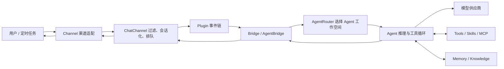

# CowAgent 代码结构与功能调整指南

> 审阅基线：CowAgent `a87207a7a44ab13aff42ea05c27e8165dc217bc7`（2026-08-06）  
> 审阅范围：服务端、Agent 内核、渠道、模型、工具、技能、记忆、知识库、自进化、插件、CLI、Web 控制台与桌面端  
> 参考资料：[功能介绍](https://docs.cowagent.ai/zh/intro/features)、[项目架构](https://docs.cowagent.ai/zh/intro/architecture)

## 1. 总体结论

CowAgent 是一个以渠道为入口、以 `Bridge` 为编排边界、以 `Agent` 为执行核心的多渠道智能体框架。当前代码同时保留了早期聊天机器人/插件体系和 2.x Agent Harness 体系，因此功能调整时需要先判断改动属于哪一层：

- 渠道协议、消息收发、群聊触发规则：修改 `channel/`。
- 会话路由、Agent 初始化、回复编排：修改 `bridge/` 与 `agent/routing.py`。
- 推理循环、工具调用、上下文压缩：修改 `agent/protocol/`。
- 工具、技能、MCP：修改 `agent/tools/`、`agent/skills/`。
- 长期记忆、知识库、自进化：修改 `agent/memory/`、`agent/knowledge/`、`agent/evolution/`。
- 模型供应商：修改 `models/`，并检查 `bridge/agent_bridge.py` 的统一模型适配。
- 配置与 Web 控制台：通常需要同时修改 `config.py`、`config-template.json`、`channel/web/web_channel.py`，桌面 UI 有专属交互时再修改 `desktop/`。

核心数据流如下：

## 2. 启动与生命周期

### 2.1 服务入口

入口是 [`app.py`](../../../app.py)：

1. `run()` 加载 `config.json` 与环境变量。
2. 同步内置技能、准备多 Agent 工作空间和子 Agent 资产。
3. 预热调度器、MCP 等服务。
4. 将 `channel_type` 解析成一个或多个渠道名称。
5. 默认启动 Web 控制台，同时由 `ChannelManager` 为每个渠道创建独立守护线程。
6. 首次启动时加载传统插件体系；桌面模式会缩减或延后部分初始化。

`ChannelManager` 负责动态添加、停止、重启渠道，并防止同一渠道实例重复启动。新增渠道必须同步更新其单例缓存清理映射，否则 Web 控制台重连时可能遗留旧连接。

### 2.2 配置加载

[`config.py`](../../../config.py) 是配置事实源：

- `available_setting` 提供默认值。
- `load_config()` 合并配置文件、环境变量及兼容字段。
- `conf()` 返回进程级配置对象。
- 密钥通过映射同步至环境变量，展示时做脱敏。
- `agent_workspace`、`agents`、`default_agent_id`、`agent_bindings` 控制多 Agent 工作空间与渠道路由。

新增用户可配置功能时，至少检查：

1. `config.py` 默认值与环境变量映射。
2. `config-template.json` 示例值。
3. Web 控制台保存/读取逻辑。
4. 桌面打包是否需要新增依赖、隐藏导入或资源文件。
5. 备份/恢复是否自动覆盖新增状态文件。

## 3. 顶层目录职责

| 路径 | 主要职责 | 常见调整场景 |
| --- | --- | --- |
| `app.py` | 进程入口、多渠道生命周期、启动预热 | 新增渠道、改变启动顺序、增加全局后台服务 |
| `config.py` | 默认配置、配置加载、密钥映射、数据目录 | 新增配置、迁移旧配置、改变状态位置 |
| `agent/` | Agent Harness 核心 | 推理、工具、记忆、技能、多 Agent |
| `bridge/` | 渠道协议与 Agent/模型之间的编排适配 | 会话初始化、路由、回复与持久化 |
| `channel/` | Web 与各 IM 渠道的收发适配 | 新增渠道、消息类型、群聊策略 |
| `models/` | 各模型厂商及会话实现 | 新供应商、新鉴权或模型能力 |
| `plugins/` | 传统事件插件体系 | 收消息/处理/装饰/发送阶段的轻量拦截 |
| `skills/` | 随项目分发的内置 Skill | 可复用业务流程与能力说明 |
| `cli/` | `cow` 终端命令 | 服务、技能、知识库、备份等运维命令 |
| `common/` | 日志、状态目录、缓存、限流、运行时身份等基础设施 | 跨模块公共能力 |
| `voice/` | ASR/TTS 供应商与音频转换 | 新语音供应商或格式 |
| `translate/` | 翻译供应商 | 新翻译后端 |
| `desktop/` | Electron + React 桌面端及 PyInstaller 后端打包 | 桌面 UI、安装包、隐藏依赖 |
| `docs/` | Mintlify 文档源 | 用户可见行为与部署说明 |
| `docker/` | 容器镜像、Compose、入口脚本 | 容器依赖与部署 |
| `tests/` | 单元与集成型回归测试 | 所有行为调整均应补充对应测试 |

## 4. 渠道层

### 4.1 统一接口

[`channel/channel.py`](../../../channel/channel.py) 定义最小 `Channel` 接口：

- `startup()` / `stop()`：生命周期。
- `send(reply, context)`：出站发送。
- `build_reply_content()`：将输入交给 `Bridge`。
- `report_startup_success()` / `report_startup_error()`：向控制台报告连接状态。

大多数 IM 渠道继承 [`channel/chat_channel.py`](../../../channel/chat_channel.py) 的 `ChatChannel`。它统一处理：

- 单聊前缀、群聊白名单、群内 @/关键词触发。
- `session_id` 与 `receiver` 生成。
- 插件事件。
- 同一会话串行队列及跨会话并发。
- `/cancel` 与 `/steer` 快速通道。
- 语音转文字、回复装饰、图片/文件分发。
- 调用 Agent 并将结果发回原渠道。

[`channel/chat_message.py`](../../../channel/chat_message.py) 的 `ChatMessage` 是渠道消息归一化对象。新增渠道应正确填充：

- 必填：`msg_id`、`create_time`、`ctype`、`content`、`from_user_id`、`to_user_id`、`other_user_id`。
- 群聊：`is_group`、`is_at`、`actual_user_id`、`actual_user_nickname`、`at_list`。
- 多媒体：通过 `_prepare_fn` 延迟下载，或在渠道侧先落盘后传入路径。

### 4.2 渠道工厂与现有微信通道

[`channel/channel_factory.py`](../../../channel/channel_factory.py) 将字符串名称映射到渠道类。当前微信生态包括：

- `weixin` / `wx`：基于微信官方 iLink Bot API 的个人微信机器人联系人。
- `wechatmp`：微信公众号。
- `wechatcom_app`：企业微信自建应用。
- `wecom_bot`：企业微信智能机器人。
- `wechat_kf`：微信客服。

这些通道的账号模型和能力不同，新增个人微信 PC Hook 通道时不应复用 `weixin` 名称，以免配置、凭证和定时任务路由混淆。

### 4.3 新增渠道的完整触点

新增渠道通常要修改：

1. `common/const.py`：渠道常量。
2. `channel/<name>/`：渠道类与消息解析类。
3. `channel/channel_factory.py`：工厂注册。
4. `app.py`：单例缓存清理映射。
5. `config.py` / `config-template.json`：配置。
6. `channel/web/web_channel.py`：控制台渠道定义和连接 API。
7. `desktop/build/cowagent-backend.spec` 与桌面依赖：动态导入/第三方包。
8. `docs/channels/`、`docs/zh/channels/`：使用文档。
9. `tests/`：解析、触发、发送、停止与重复启动测试。

## 5. Bridge 编排层

### 5.1 `Bridge`

[`bridge/bridge.py`](../../../bridge/bridge.py) 是兼容门面：

- 传统模式通过 `models/bot_factory.py` 创建聊天模型。
- Agent 模式通过 `get_agent_bridge()` 延迟创建 `AgentBridge`。
- 统一提供聊天、ASR、TTS、翻译入口。

### 5.2 `AgentBridge`

[`bridge/agent_bridge.py`](../../../bridge/agent_bridge.py) 负责：

- 将 CowAgent 的模型实现适配为 Agent 所需的 `LLMModel`。
- 按 `agent_id + session_id` 缓存独立 Agent 实例。
- 调用 `AgentRouter` 选择工作空间。
- 注册取消/引导状态，执行流式 Agent 回合。
- 将用户消息、助手消息和工具结果写入会话存储。
- 把 Agent 生成的文件转成渠道可发送的 `Reply`。
- 为定时任务附加原渠道与接收者信息。
- 在对话结束后触发 MCP 热更新和自进化活动记录。

### 5.3 `AgentInitializer`

[`bridge/agent_initializer.py`](../../../bridge/agent_initializer.py) 按工作空间初始化一个 Agent：

1. 加载 `.env` 和工作空间上下文文件。
2. 创建记忆管理器、向量提供商与记忆工具。
3. 创建当前模型适配器。
4. 加载内置工具、MCP 工具和条件工具。
5. 创建 SkillManager。
6. 初始化定时任务服务并注入渠道上下文。
7. 恢复会话历史。

因此，凡是“每个 Agent/每个会话应有独立实例”的能力，应优先放在初始化器或工作空间服务中，而不是进程全局单例中。

## 6. Agent 核心

### 6.1 协议与执行循环

[`agent/protocol/agent.py`](../../../agent/protocol/agent.py) 保存系统提示、消息、工具、SkillManager、MemoryManager 和模型。`run_stream()` 将具体回合交给 [`agent/protocol/agent_stream.py`](../../../agent/protocol/agent_stream.py)。后者负责：

- 调用模型并解析流式文本/思考/工具调用。
- 串行或并行执行工具。
- 检测重复失败、缺失参数和未知工具。
- 处理取消、实时引导和空回复。
- 控制上下文窗口、裁剪历史工具结果、自动压缩。
- 产生进度、工具、产物等事件。

调整工具循环或上下文策略的风险较高，应重点回归：工具消息配对、取消、上下文溢出、并行工具调用和历史持久化。

### 6.2 多 Agent 与路由

- [`agent/registry.py`](../../../agent/registry.py)：一个 `AgentProfile` 对应一个完整且独立的工作空间；禁止两个 Agent 共享同一路径。
- [`agent/routing.py`](../../../agent/routing.py)：按显式 Agent、`channel_type + conversation_id`、渠道默认绑定、全局默认的优先级路由。
- [`common/runtime_identity.py`](../../../common/runtime_identity.py)：把 `agent_id` / `session_id` 绑定到当前执行上下文，供状态目录和工具读取。

渠道新增会话标识时，要确保 `session_id` 稳定且不会跨联系人/群聊碰撞，否则会造成对话、记忆和取消操作串线。

## 7. 工具、技能与插件的区别

| 机制 | 位置 | 适合场景 | 关键边界 |
| --- | --- | --- | --- |
| Tool | `agent/tools/` | 原子能力，如文件、终端、浏览器、调度器 | 由模型直接调用，应有明确参数和安全边界 |
| MCP Tool | `agent/tools/mcp/` | 外部标准化工具服务 | 支持 stdio/SSE/HTTP、OAuth、热更新与按需检索 |
| Skill | `agent/skills/`、工作空间 `skills/` | 多步骤工作流、领域操作说明 | 主要通过提示注入引导 Agent 组合工具 |
| Plugin | `plugins/` | 收消息到发回复链路上的同步拦截/装饰 | 传统体系，事件点固定，不是 Agent 工具 |

工具注册由 [`agent/tools/tool_manager.py`](../../../agent/tools/tool_manager.py) 完成；工具目录通常包含实现类和描述/参数定义。Skill 由 [`agent/skills/manager.py`](../../../agent/skills/manager.py) 与 loader/frontmatter 模块管理，支持内置与工作空间自定义来源。

插件事件依次为：`ON_RECEIVE_MESSAGE` → `ON_HANDLE_CONTEXT` → `ON_DECORATE_REPLY` → `ON_SEND_REPLY`。若新能力需要 Agent 自主选择，应做 Tool/Skill；若只是固定消息过滤或格式化，才优先考虑 Plugin。

## 8. 记忆、知识库与自进化

### 8.1 记忆

`agent/memory/` 实现三层记忆：

- 会话上下文：Agent 当前消息列表及 SQLite 会话存储。
- 天级记忆：从对话中生成每日摘要。
- 长期记忆：`MEMORY.md`，由 Deep Dream 进一步蒸馏。

搜索采用关键词/FTS 与可选向量嵌入组合。更换嵌入模型或维度时，需要考虑索引重建和损坏恢复。

### 8.2 知识库

`agent/knowledge/` 把结构化知识保存为工作空间下的 Markdown 页面，并维护索引与交叉引用。Web 控制台负责知识文档浏览和图谱展示。

### 8.3 自进化

`agent/evolution/` 在会话空闲后使用隔离执行环境复盘对话，允许对工作空间中的技能、记忆和知识进行受控修改，并记录可撤销备份。不要把渠道运行状态、账号凭证或进程配置纳入自进化可写范围。

## 9. 模型、语音与多模态

[`models/bot_factory.py`](../../../models/bot_factory.py) 根据 `bot_type` 创建供应商实现；`AgentLLMModel` 再将其包装为 Agent 的统一调用协议。新增供应商时通常需要：

1. Bot 与 Session 实现。
2. Factory 与常量注册。
3. 配置、密钥迁移、Web 控制台模型定义。
4. 推理强度、视觉、工具调用、流式输出等能力声明。
5. 供应商专项测试。

ASR/TTS 位于 `voice/`，由 `voice/factory.py` 选择。渠道只负责接收/发送媒体，格式转换和识别尽量走统一语音层。

## 10. Web 控制台与桌面端

[`channel/web/web_channel.py`](../../../channel/web/web_channel.py) 同时承担 Web 聊天渠道和大量管理 API，包括模型、渠道、会话、知识库、定时任务与微信扫码。文件较大，修改前先用路由类名或 API 路径精确定位。

`desktop/` 是 Electron + React 客户端：

- `desktop/src/main/`：Electron 主进程与后端进程管理。
- `desktop/src/renderer/`：React 页面、组件、状态、API 客户端。
- `desktop/build/cowagent-backend.spec`：PyInstaller 动态导入与资源。
- `desktop/build/requirements-desktop.txt`：桌面后端依赖白名单。

服务端支持不等于桌面包已支持。任何依赖动态 DLL、平台原生组件或延迟导入的功能，都必须单独验证 PyInstaller 打包。

## 11. 状态与数据位置

默认工作空间为 `~/cow`，实际路径受 `agent_workspace` 或 `agents[].workspace` 控制。状态目录相关逻辑集中在 `common/state_dir.py`，主要数据包括：

- Agent 身份、人设、规则、长期记忆与知识库 Markdown。
- 会话 SQLite 数据与索引。
- Skills、MCP 配置、环境变量。
- 调度任务、进化备份与记录。
- 渠道凭证和游标；部分历史渠道仍使用单独的用户目录文件。

新增状态文件时必须明确：所属 Agent、所属会话还是进程全局；是否包含密钥；是否应备份；是否能在 Web 控制台下载；是否允许自进化工具访问。

## 12. 常见功能调整的定位表

| 需求 | 首要位置 | 还需检查 |
| --- | --- | --- |
| 新增 IM 渠道 | `channel/`、`channel_factory.py` | `app.py`、配置、Web、桌面打包、文档、测试 |
| 调整群聊触发 | `ChatChannel._compose_context()` 或渠道预过滤 | 会话 ID、@ 解析、白名单 |
| 新增模型 | `models/` | `AgentLLMModel`、配置 UI、能力测试 |
| 新增原子能力 | `agent/tools/` | ToolManager、安全校验、文档、测试 |
| 新增业务流程 | 内置或工作空间 Skill | 依赖探测、Skill Hub 元数据 |
| 消息过滤/回复装饰 | `plugins/` | 事件优先级与 `BREAK_PASS` 行为 |
| 调整记忆策略 | `agent/memory/` | 索引迁移、Deep Dream、会话恢复 |
| 调整知识图谱 | `agent/knowledge/` | Web 图谱 API 与前端 |
| 调整会话路由 | `agent/routing.py`、`agent/registry.py` | 渠道生成的 session/receiver、取消键 |
| 调整定时推送 | `agent/tools/scheduler/` | 渠道主动发送能力、接收者持久化 |
| 桌面专属能力 | `desktop/` | PyInstaller、平台签名、原生依赖 |

## 13. 修改与验证建议

1. 先确认变更属于渠道、Bridge、Agent、Tool/Skill 还是 Plugin，避免跨层复制逻辑。
2. 保持渠道对象只做协议适配，不在渠道中重新实现模型、记忆或任务规划。
3. 新会话必须具备稳定且隔离的 `session_id`，主动发送必须具备可持久化的 `receiver`。
4. 新配置要有安全默认值，密钥不写日志、不进入 Agent 提示、不通过普通文件工具暴露。
5. 平台原生依赖使用条件导入，不能让不启用该功能的 Linux/macOS 安装失败。
6. 测试至少覆盖正常路径、重复消息、停止/重连、权限过滤、群聊触发、多媒体失败和会话隔离。
7. 用户可见行为改变后同步更新中文/英文文档与发布说明。

## 14. 已识别的维护注意点

- 代码仍保留传统 Bot/Plugin 与新 Agent/Tool/Skill 两套扩展机制；新增能力前要明确归属，避免双重执行。
- 渠道会同时受渠道自身过滤和 `ChatChannel` 的全局群聊/前缀规则影响，新增渠道需要设计两者的优先级。
- `channel/web/web_channel.py` 集中了较多管理 API，修改时应增加针对具体 Handler 的测试，避免全局回归。
- 动态导入较多，源码运行通过后仍需验证桌面 PyInstaller 包和 Docker 环境。
- 当前项目声明支持较宽的 Python 版本范围，但部分新增依赖可能只支持较新的 Python；应通过条件依赖或可选安装隔离。

