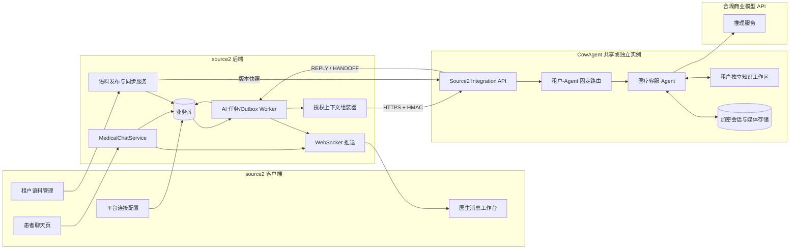
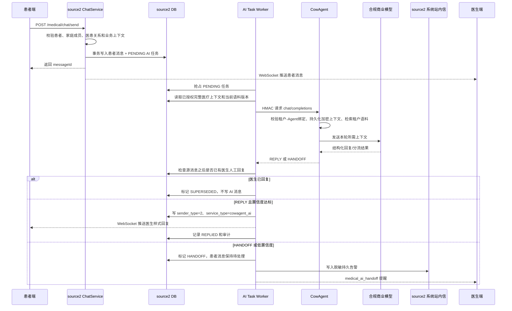

# source2 医患聊天对接 CowAgent 方案

> 文档状态：实施方案（首期）  
> 编写日期：2026-09-03  
> CowAgent 审阅基线：`a87207a7a44ab13aff42ea05c27e8165dc217bc7`  
> 主版本：`D:\workspace\AI\CowAgent\docs\zh\development\source2-medical-chat-integration-plan.md`  
> 同步副本：`D:\workspace\Medical Card\source2\cowagent-medical-chat-integration-plan.md`

> 实施更新：2026-09-10 已完成首期端到端代码及安全边界加固，见“当前实施状态”。

## 0. 当前实施状态（2026-09-10）

首期端到端实现已落到 CowAgent、source2 后端及 source2 管理端：

- CowAgent 已增加 `/api/integrations/source2/v1/health`、`knowledge/{agentId}`、`chat/completions`、归档重加密和紧急手工清理接口；实现 HMAC-SHA256、基于 Agent 工作区 SQLite 的跨进程重启防重放、租户/Agent/模型配置固定绑定、每 Agent 实际模型覆盖、原子且加密的语料快照、指定语料版本校验、医疗风险硬分流、无工具模型调用、幂等响应和 AES-256-GCM 归档。医疗链路指定的低随机性参数 `temperature=0.1` 已贯通统一模型桥接层的同步与流式调用；医疗模型调用同时通过统一日志隔离上下文执行，供应商适配器在同步请求、流式迭代或异常堆栈中输出的提示词、响应体和异常正文都会在日志处理器前被替换为固定脱敏标记，普通聊天日志不受影响。FAQ 与文档正文均参与检索，长文档按 1600 字、200 字重叠窗口切块，单次只发送最多 8 个相关片段并保留原语料引用。接口在读取 JSON 前即限制聊天请求为 2MB、语料快照为 50MB，并限制单次语料最多 5000 条；聊天请求必须携带合法 `requestId` 和幂等键。语料、请求/响应和所有上下文媒体均支持多版本密钥环，历史数据按信封中的 `keyId` 解密；归档可逐条迁移到当前活动密钥，语料在同版本重新同步时自动迁移。归档重加密和删除使用与业务调用完全独立的管理员凭证。
- CowAgent 的 AgentRegistry 在配置加载及动态更新时都会比较解析后的物理路径，拒绝任意 Agent 工作区相同、互为父子目录或通过目录别名形成重叠；Source2 鉴权层保留同样检查作为遗留或异常注册状态下的第二道防线。语料、归档、防重放数据库、幂等锁及管理员审计的每个目标路径在访问前都会解析并确认仍位于绑定 Agent 工作区内，子目录符号链接或重解析造成的工作区逃逸以 `STORAGE_PATH_NOT_ISOLATED` 失败关闭。
- CowAgent 对医疗语料临时目录、归档目录、防重放数据库目录、幂等锁目录和管理员审计目录执行宿主机权限加固：POSIX 下从工作区子目录到最终落盘目录的整条敏感目录链固定为 `0700`，加密文件、SQLite 主文件及 WAL/SHM、锁文件和无正文管理员审计固定为 `0600`；新文件以受限 mode 原子创建，权限设置失败统一以 `STORAGE_PERMISSION_HARDENING_FAILED` 失败关闭并清理未提交的临时密文。仓库新增只读 `source2_medical_storage_preflight.py`，逐租户验证工作区不重叠、两类医疗存储已初始化、目录树无符号链接/重解析点，并检查 POSIX 所有者与精确 mode 或 Windows 服务账号专属 ACL。Windows 不以 POSIX mode 代替安全边界，生产部署必须通过该探针证明工作区未向非受信任账号授予访问权。
- CowAgent 在业务鉴权和管理员归档鉴权阶段都会解析并恒定时间比较不同租户密钥环中的全部 AES 数据密钥（包括仍用于解密留存数据的历史版本）；即使工作区已分离，只要两个启用租户复用了相同密钥材料，就以 `DATA_KEY_NOT_ISOLATED` 拒绝流量。同一租户的多 Agent 可按租户密钥策略共享；当前租户任一已配置密钥无法解析时按配置错误失败关闭，无关租户中无法解析的单个密钥不影响当前租户，但该无关租户处理自身流量时仍会失败关闭。
- 已增加共享实例双租户正向验收：两个租户使用独立 Agent、工作区、模型和数据密钥发布不同语料后，相同问题只能命中各自答案，且加密归档保持租户绑定；交叉组合 App Key、租户和 Agent 会被拒绝。source2 客户端也以自动化测试确认 `SHARED` 与 `DEDICATED` 两种部署模式对健康、语料同步和聊天接口使用完全相同的协议路径。
- 首期商业模型调用只接收本轮机构服务问题和最多 8 个相关语料片段，不接收患者、家庭成员、病历、急诊或历史会话上下文；完整授权上下文仅保存在租户加密归档。单个媒体归档最多 20MB，同一聊天请求的去重媒体累计最多 64MB，断点重试会把已有加密媒体计入累计额度，避免 32 个媒体槽位放大为无界存储。紧急清理与归档重加密会获取聊天使用的同一跨进程幂等锁，避免清理完成后在途请求重新写回归档。
- CowAgent 下载授权媒体时会在读取正文前拒绝不在白名单内的响应 MIME，并使用循环有界读取；合法的网络短读会继续收集且内存不会超过当前剩余额度加一字节。响应携带 `Content-Length` 时只接受无符号十进制并核对最终字节数；非法长度、提前断流或超限响应在加密归档写入前失败，不能把截断的病历附件、图片或语音当成完整文件永久保存。
- source2 已在对象存储短期签名地址之前增加一次性媒体代理：Worker 为每个媒体对象生成 256 位随机令牌，将租户、稳定对象摘要和上游签名地址以 AES-256-GCM 加密后写入 Redis，并设置 5 分钟 TTL；加密 AAD 同时绑定令牌和对象摘要，Redis 密文即使被复制到另一令牌键或对象路径也无法解密。公开地址只暴露稳定对象摘要和随机令牌。下载端通过 Lua `GET + DEL` 原子消费令牌，首次请求后立即失效，过期、重复、篡改或对象摘要不匹配均返回 404；代理禁止上游重定向并再次执行 20MB 大小、严格 `Content-Length` 和完整读取检查，Redis及对象存储异常只向普通日志暴露固定错误，不保留可能含令牌或签名地址的底层异常链。连接测试和租户启用均强制验证代理地址及令牌加密密钥，缺少生产 HTTPS 配置时不能形成新的有效启用状态。代理未配置或令牌生成失败时不退回永久地址，而是让媒体问题安全转人工。CowAgent 按去除查询串后的稳定对象路径去重与计算幂等语义哈希，下载使用本次请求的完整地址，但写入长期加密请求归档前递归移除所有 `mediaUrl` 查询串和片段；重试或管理员重加密访问旧版归档时也会自动迁移残留的历史签名参数。因此同一任务可换发新令牌而不会形成凭证长期留存、重复媒体归档或幂等冲突。
- 租户维护的语料同样视为不可信策略输入：相关检索片段命中诊断、治疗、用药、急症风险或提示注入特征时不调用模型并直接转人工；模型生成正文还会经过第二次医疗风险与提示注入硬门控，命中时清空正文和引用并返回 `HANDOFF/POLICY_BLOCKED`。
- 结构化急诊上下文优先于文本意图分类：只要请求携带已授权的 `context.emergency`，即使本轮文本与营业时间、地址等服务 FAQ 完全匹配，也不会调用商业模型，而是固定返回 `HANDOFF/MEDICAL_RISK` 交由医生处理。
- CowAgent 语料同步使用严格请求与条目字段白名单，拒绝空版本、无效校验和、未知字段、重复/超长 ID、非法类型、超长正文及文档 `sourceHash` 不匹配；source2 在 FAQ 与文档互相转换时清除另一类型的专属字段，避免旧问题或旧答案混入新快照。
- source2 与 CowAgent 均要求业务 App Secret 至少 32 字节；CowAgent 的归档清理/重加密管理员 App Secret 也至少 32 字节，弱 HMAC 密钥配置在连接建立前即被拒绝。source2 对首次配置和替换已有密钥都按 UTF-8 字节数执行后端校验，管理端表单使用相同口径提前提示。
- CowAgent 会分别检查业务 App Key 和管理员 App Key 在各自访问平面内全局唯一；重复配置不再依赖列表顺序命中某个租户，而是统一以 `APP_KEY_NOT_UNIQUE` 失败关闭。`enabled=false` 只关闭业务凭证；独立的 `admin_enabled` 默认保持开启，使停用业务或撤销审批后仍可清理留存数据。只有数据处置完成后才能显式关闭管理员入口；只要业务或管理员平面任一仍启用，工作区与历史数据密钥隔离检查就继续覆盖该绑定。
- source2 框架访问日志对所有直接或带网关前缀的 `/medical/**` 请求强制关闭请求参数、响应正文和结果消息记录；路径判断会归一化反斜杠、最多三层 ASCII 百分号编码，并识别 Spring 路由可能去除的矩阵参数边界，避免原始 URI 与框架匹配路径不一致时绕过脱敏。即使控制器显式设置 `responseEnable=true` 也不能覆盖该门禁，非医疗接口保持原有可配置日志行为。
- source2 在微服务模式下不再通过通用 GET 查询参数向 infra 文件服务传递医疗媒体永久 URL，而是调用专用 `POST /rpc-api/infra/file/medical/presigned-url` JSON RPC。该路径主动落入同一医疗日志脱敏门禁，请求参数、请求体、响应签名 URL 和结果消息均不进入普通访问日志；旧通用预签名接口保留供非医疗模块兼容使用。
- source2 对 CowAgent 的真实 HTTP 语料同步请求已有线级契约测试：独立地按实际收到的方法、原始路径、租户、时间戳、Nonce、幂等键和原始请求体重算 HMAC，确保序列化后的传输正文与签名正文相同。响应引用 ID 只接受字符串或 JSON 整数；浮点数即使数值上等于整数也会以 `RESPONSE_CITATIONS_INVALID` 失败关闭。
- CowAgent 对语料发布正文中的租户、版本、校验和及聊天正文中的租户、Agent、模型配置、语料版本执行严格 JSON 字符串类型和长度校验；`publishedAt` 与 source2 的 `LocalDateTime` 序列化协议一致，只接受非负 JSON 整数毫秒时间戳。source2 对健康检查、语料同步确认和聊天响应执行对应的严格类型校验：字符串字段不得用数字或布尔值替代，健康时间戳和语料条目数量必须为 JSON 整数；不再依赖 `String.valueOf` 隐式转换。类型不符会失败关闭，聊天任务转入受控重试/人工处理链路。
- source2 将健康检查、语料同步确认和聊天响应都视为封闭协议：三类回包分别使用固定顶层字段白名单，任何未知扩展字段均在写入健康状态、切换活动语料或处理患者回复前失败关闭；错误只保留固定异常类型或稳定错误码，不回显未知字段名及内容。管理接口仍按独立公开字段白名单重建响应，形成协议校验与浏览器输出两层边界。
- CowAgent 的语料和聊天 HTTP 入口使用严格 JSON 解析：根值必须是对象，任意层级重复成员名、`NaN`、`Infinity`、非法 UTF-8 或非法 JSON 都在业务处理前拒绝，避免同一份已签名正文出现多种业务解释。
- CowAgent 的语料同步和聊天写接口在读取正文前强制校验 `Content-Type: application/json`（允许大小写差异及其他参数；未声明 charset 时按 UTF-8，声明时只能是 UTF-8，且不得重复声明）；缺失、使用其他媒体类型或声明其他字符集固定返回 `415 UNSUPPORTED_MEDIA_TYPE`，避免代理或客户端以非 JSON 语义提交已签名正文。
- CowAgent 的全部 source2 医疗接口在读取正文、执行 HMAC 或 JSON 解析前只接受缺失或显式 `identity` 的 `Content-Encoding`；`gzip/br/deflate`、组合编码及重复 `identity` 固定返回 `415 UNSUPPORTED_CONTENT_ENCODING`。因此聊天 2 MiB、语料 50 MiB 和无正文接口的限制始终作用于实际传输字节，不受 WSGI 容器或反向代理解压顺序影响。
- 商业模型返回的分流 JSON 使用与外部请求相同的严格解析规则：必须是单一对象，拒绝任意层级重复键、`NaN/Infinity` 和非对象根值；顶层只允许 `decision/replyText/confidence/reasonCode/citationIds`。额外字段统一返回不包含原始字段名或内容的 `422 INVALID_MODEL_FIELDS`，避免模型输出中的医疗内容经协议错误泄露。
- source2 的 CowAgent HTTP 客户端同样启用 JSON 重复成员检测和尾随根值拒绝；异常响应只映射为稳定的 `INVALID_RESPONSE_JSON`，不会把原始上游响应或医疗正文写入异常消息。
- source2 在读取 CowAgent 响应体前先校验响应编码和媒体类型：业务客户端、健康探针和归档工具都显式发送 `Accept-Encoding: identity`；`Content-Encoding` 只允许缺失或 `identity`，其他值固定映射为 `502 UNSUPPORTED_RESPONSE_CONTENT_ENCODING`；`Content-Type` 只接受 `application/json`（允许大小写差异及其他参数；未声明 charset 时按 UTF-8，声明时只能是 UTF-8，且不得重复声明），缺失、其他媒体类型或其他字符集固定映射为 `502 UNSUPPORTED_RESPONSE_MEDIA_TYPE`。CowAgent 专用响应同时发送 `Cache-Control: no-store, no-transform`，要求中间层不得缓存或变换。错误不回显不可信响应头或正文，避免压缩响应绕过线级限长，或反向代理登录页、WAF 页面和纯文本错误被当作集成协议解析。
- CowAgent 的健康检查、归档重加密和归档清理属于无正文协议；处理器会在鉴权前以 0 字节上限读取请求并拒绝任何夹带正文，确保不存在未被 HMAC 正文摘要覆盖的 HTTP 数据。
- CowAgent 启动配置日志使用失败关闭的递归脱敏：`app_secret`、管理员 Secret、活动密钥标识及 `data_keys` 密钥环等敏感键不论值是字符串、字典或列表都不会输出原值，短 Secret 也全部遮盖；配置字符串解析异常时只输出固定占位符和异常类型，不再回退打印原始配置。该规则同时覆盖大小写不同的敏感键名，避免 AES 密钥环因嵌套结构绕过普通字符串脱敏。
- CowAgent 的有界请求体读取器会循环收集底层流的合法短读，且每次读取和累计内存始终限制在接口上限加一字节以内；因此分块或短读传输不会截断参与 HMAC 和 JSON 解析的正文，超限正文仍会在完整缓冲前拒绝。
- source2 会在本轮消息和近期会话上下文的出站边界，把患者端 facade 使用的数字消息类型 `1/2/3/4` 以及文字别名统一映射为 `text/image/voice/file`；只有规范化后的文本消息才携带正文，避免真实 UI 文本因类型为 `"1"` 被清空、误转人工或从加密历史归档中丢失。患者聊天页在渲染历史消息和 WebSocket 消息前也把同一数字协议统一映射为 `text/image/voice/archive`，确保文本、图片、语音和档案气泡都能正确显示。图片、语音或文件的短期签名地址生成失败时，CowAgent 仍返回 `HANDOFF/MEDIA_REQUIRES_DOCTOR_REVIEW`，不会因媒体 URL 为空退化成可重试协议错误。
- source2 的主患者发送入口 `/medical/chat/send` 与遗留兼容入口 `/medical/message/chat/send` 已统一进入 `MedicalChatService`。遗留入口在保持原有 `attachmentUrl` 客户端兼容的同时，已完整接收并映射 `mediaUrl`、`familyMemberId`、`appointmentId`、`archiveId`、`emergencyId` 和 `serviceType`，不再因兼容层丢失家庭成员或医疗上下文引用；授权校验、患者消息与 AI 任务同事务写入、旧自动回复切换和 WebSocket 提交后推送均复用同一实现。旧 `MedicalChatMessageService.sendChatMessage` 已移除，避免其他调用方绕过统一写入链路。遗留聊天分页、列表、未读数和标记已读接口支持显式 `familyMemberId`，统一先校验成员归属，再按患者主 ID 与家庭成员范围查询；仅传旧参数时保持原行为。读取响应通过显式 `ChatMessageRespVO` 白名单重建，不再直接序列化数据库对象的 `creator/updater/updateTime/deleted` 等内部字段。相关控制器、消息服务、统一聊天服务、调度器和任务服务定向回归共 112 个测试通过。
- source2 查询最近 20 条会话时仍使用倒序索引高效截取，但在构造授权上下文前恢复为从旧到新的自然会话顺序，保证加密归档及后续策略版本不会把回复解释到触发消息之前。
- source2 将病历附件的遗留存储字段 `attachmentType/fileName/fileSize` 统一映射为 CowAgent 医疗上下文契约的 `type/name/size`，与 `id/mediaUrl` 一同通过严格字段白名单；内部备注、永久文件地址及其他数据库字段不会外发。跨端契约测试覆盖带安全元数据的授权病历附件，防止合法附件因字段名不一致被错误转人工。
- source2 已增加连接配置、机构语料、不可变语料版本、可靠聊天任务和无正文审计五张租户表；患者消息与 AI 任务在同一事务写入，患者和医生主消息的数据库插入均强制校验影响行数，写入失败时不创建 AI 任务、不推送 WebSocket 且整笔事务回滚。旧医生关键词自动回复也校验消息插入结果，写入失败时不会推送不存在的回复。医患聊天、语音转写、OCR、急症评估及 WebSocket 失败日志只记录业务 ID 和异常类型，不记录供应商错误正文或完整异常栈。source2 调用 CowAgent 时使用流式有界读取，在 Hutool 缓冲响应正文之前强制执行 1 MiB 字节上限；超限、读取失败及无效 JSON 只产生稳定错误码，不回显上游医疗正文。应用内 Worker 默认每 2 秒按租户处理任务并保留可选 XXL-Job，任务按会话顺序执行；远程模型调用不占用数据库事务，返回后才以短事务执行 `PROCESSING -> FINALIZING` 原子仲裁和回复落库。任务的 `processing_time` 同时作为认领租约令牌；陈旧任务回收时清空旧租约，后续最终化、取消、失败重试和终态写入均必须匹配原租约，旧 Worker 不得推进已被新 Worker 重新认领的任务。Worker 在每次外发医疗上下文前重新确认患者、家庭成员、医生、预约关系、急诊归属和病历归属，授权失效时按 `HANDOFF/CONTEXT_AUTHORIZATION_REVOKED` 结束且不调用 CowAgent。前置取消、废弃、授权转人工、调用失败重试状态与各自的无正文审计在同一短事务提交；医生抢答方法自身声明事务边界，审计插入失败会回滚任务状态，人工接管通知只在提交成功后发送。患者/医生 WebSocket 通知注册为事务提交后回调，回滚时不会发出数据库中不存在的回复或状态。AI 回复面向患者的实时推送只允许使用 `medical_patient.user_id` 解析出的会员登录账号作为 WebSocket 收件人；患者不存在、未绑定会员账号或查询异常时保留已提交的回复供客户端后续拉取，但停止实时推送，绝不把业务患者 ID 回退为会员账号 ID。最终落库前会重新读取租户开关，管理员紧急停用后，在途结果原子转为 `CANCELLED` 且不发送患者消息。患者发送事务会在分配新消息 ID 前先原子废弃同会话旧活动任务，模型返回后仍再次检查更新患者消息；因此旧 AI 要么在新问题之前完成，要么因任务状态仲裁失败而回滚。医生抢先回复也会废弃迟到结果；模型调用期间若机构发布了新语料版本，旧版本结果强制转人工。媒体只允许通过 5 分钟、Redis 原子消费的一次性代理地址外发，签名或令牌生成失败时关闭外发且不退回原始地址。CowAgent 回包必须与请求 ID、幂等键、策略版本和活动语料版本完全绑定；source2 先以封闭的顶层字段白名单拒绝所有未知扩展字段，再校验模型标识、引用结构，并以自己的不可变语料快照核验引用 ID、覆盖引用标题，结构化字段不合法时立即转人工且不重试。AI 回复以医生样式写入且标记 `service_type=cowagent_ai`；审计明细只保存策略版本、语料引用 ID、调用耗时、次数、错误码及可用的模型 Token 计数，不保存患者或回复正文。语料详情、任务及审计管理接口均使用专用响应 VO 白名单，不向浏览器序列化会话键、幂等键、内部错误明细或数据库操作人元数据。
- source2 主聊天身份与实时路由也采用强绑定失败关闭：会员登录账号必须解析到有效患者，管理员登录账号必须解析到有效医生；普通患者消息、普通医生消息、旧关键词自动回复、AI 转人工、AI 回复状态及会话可见性恢复只能使用患者或医生记录中明确绑定的登录账号。绑定缺失、记录缺失或查询异常时不执行相应实时推送、配置读取或偏好写入，不再以患者 ID、医生 ID 或登录 ID 猜测另一命名空间的身份；已经成功提交的聊天消息仍可通过授权查询获得。AI 转人工的持久站内信在医生账号暂不可解析时以 `DOCTOR_ACCOUNT_UNAVAILABLE` 进入有限重试，不向错误账号发送。
- 租户启用 CowAgent 前会在本地数据库检查医患账号绑定完整性：所有在职医生必须绑定管理员登录账号，所有患者主档必须绑定会员登录账号；同一租户内所有未删除医生不得重复绑定同一管理员账号，患者主档也不得重复绑定同一会员账号。缺失、重复或无法完成检查时，在调用 CowAgent 健康接口之前即拒绝启用，避免配置表显示可用但消息实际路由歧义；该门禁只读取医患业务 ID、登录账号 ID 和医生状态，不加载姓名、联系方式、证件或执业材料等无关敏感字段。患者端创建主档时忽略请求体中的 `userId` 并强制绑定当前会员登录账号，医生创建/编辑和患者创建入口还会在写入前返回稳定的重复绑定业务错误，数据库以“租户 + 仅未删除记录的生成账号键”唯一索引消除并发先查后写竞态；升级脚本检测到历史重复主档时中止且不自动合并或删除医疗数据。家庭成员继续使用独立家庭成员表，不通过重复患者主档表达。
- source2 患者端主档及家庭成员接口统一使用当前会员账号解析出的患者主档作为授权范围：主档更新会覆盖请求中的患者 ID，主档读取和兼容分页只返回当前患者；`get-by-user` 只接受当前会员账号。家庭成员读取、列表、分页和默认成员切换保留可选 `patientId` 兼容参数，但参数为空时自动填入当前患者，非空且不等于当前患者时按不存在失败，并且不调用下游业务查询。医生工作台和管理后台继续使用各自独立的授权接口，不借用患者端入口跨患者访问。
- 医生工作台患者接口已补齐方法级权限：创建患者要求 `medical:patient:create`，患者详情、家庭成员反查、分页、搜索和就诊历史要求 `medical:patient:query`。该加固保留现有机构内患者可见范围与脱敏响应，不允许缺少患者管理权限的后台账号绕过菜单直接调用接口。
- source2 医患授权按患者本人和具体家庭成员做对称隔离：关系与指定预约查询对 `familyMemberId=null` 使用 `IS NULL`，非空时精确匹配；聊天附带病历必须同时精确匹配患者与家庭成员。急诊消息还必须匹配接诊路由，未分配急诊只能进入 `doctorId=0` 待分配队列，已分配急诊只能发送给记录中的医生。Worker 组装上下文时再次同时校验急诊患者与医生，避免授权预检后急诊被重新分配造成跨医生数据外发。
- 陈旧 Worker 租约回收也受有限重试约束：每次超时增加 `attempt_count` 并写入 `LEASE_EXPIRED_RETRY/FAILED` 无正文审计；超过五次重试后终止为 `FAILED` 并通知医生，不能因进程反复崩溃无限循环。
- source2 会检查可靠任务和患者可见 AI 回复的数据库插入行数；数据库静默返回 0 时立即抛错，使患者消息事务或 AI 最终化事务回滚，不会留下“界面显示处理中但无任务”或“任务已回复但无消息”的伪成功状态。结构化模型结果的 `decision`、`confidence`、`model` 和 `corpus_version` 与任务终态在同一租约条件更新中持久化，管理端任务记录不再依赖仅存在于内存或审计表的数据。
- 本地 `MedicalAiChatTaskScheduler` 已增加直接多租户测试：验证每个机构都在自己的 `TenantContextHolder` 中处理、执行后恢复原上下文、单个机构异常不阻塞后续机构、同实例重入不会重复扫描，以及租户列表获取异常后运行锁仍会释放。调度器使用显式 `Runnable` 进入租户上下文，异常日志可保留真实异常类别而不记录异常正文。为避免一个繁忙机构在单轮内串行占用最多 20 次慢模型调用，本地调度器新增 `medical.ai.local-worker-max-tasks-per-tenant`，默认每租户每轮只处理 1 个任务，启动时只接受 1–20；服务层同时拒绝 1–100 以外的任意批量值，XXL-Job 兼容入口仍使用 20。调度器与任务服务组合回归共 63 个测试通过。
- 语料创建、版本快照创建和版本激活也检查数据库影响行数；发布成功后的版本状态使用原状态条件更新，发布失败回写只作用于同步开始时相同 `revision` 的语料，避免覆盖同步期间的新编辑。新版本同时以活动版本和数据库内已生成最大版本的毫秒时间段为下界，系统时钟回拨、同毫秒连续操作，或 CowAgent 已应用但 source2 本地激活事务失败时仍严格递增；回滚在创建新快照前先确认来源确实是曾成功激活的 `ARCHIVED` 版本并确认租户连接存在，失败或残留 `SYNCING` 快照不能伪装成历史版本。对当前 `ACTIVE` 版本重新同步失败时只记录脱敏错误，不把仍在服务的活动快照错误降级为 `FAILED`。
- 语料远端同步后的本地激活若在事务提交阶段失败，失败恢复不会信任已被事务内代码改写的内存状态，而会重新读取数据库中的快照状态：数据库仍为 `ACTIVE` 时只记录脱敏同步错误，已回滚到 `SYNCING` 等非活动状态时原子转为 `FAILED`，避免留下无法重试或回滚的永久处理中版本。
- 管理端已增加“智能客服”页面，提供 FAQ/文档维护、浏览器本地文本导入、服务端内容 SHA-256、服务端分页与筛选、按需详情、预览、发布前新增/修改/移除/未变差异摘要、完整版本发布、历史版本、语料同步失败重试、通过新版本回滚、校验和与同步时间、连接配置、连接测试、无需重填连接密钥的紧急停用和租户级观测模式。页面权限判断兼容框架超级管理员的 `*:*:*` 通配权限，并与后端 `super_admin + 具体权限` 约束对齐；只有连接查询权时表单为只读，保存和紧急停用仅向具有连接更新权限的平台管理员开放，连接测试使用独立的 `medical:ai-config:test` 权限并兼容已经获得更新权限的平台角色。语料列表只返回最多 240 字正文预览，避免批量下发长文档；编辑和预览时再获取完整内容。历史版本、任务与无正文审计记录也使用服务端分页；历史版本响应只含版本元数据，永不下发 `snapshot_json`。任务和审计分别支持状态、源消息、原因码以及动作、任务、请求 ID 等筛选。连接查询显式返回 `secretConfigured` 与掩码，前端不再通过掩码字符串推断密钥是否存在。连接测试及语料发布、重试、回滚接口会再次按协议字段白名单重建返回值，不把 CowAgent 响应中的未知扩展字段透传给浏览器。语料远程同步不占用数据库事务；成功返回后通过短事务原子激活条目、配置和版本状态，并以条目 `revision` 及连接配置 `revision` 条件更新阻止同步期间的并发编辑或连接切换造成半完成状态。连接保存、紧急启停和远程健康回写同样使用连接配置 `revision` 乐观锁；远程检测返回时若配置已变化，旧结果会被拒绝，不能覆盖新连接或错误地标记为可启用。观测模式调用真实 CowAgent 并记录 `SHADOW_DECISION`，但任何决策都不会生成患者可见回复。App Secret 查询只返回掩码，数据库字段由专用 AES-256-GCM TypeHandler 认证加密，独立字段密钥必须由 `MEDICAL_AI_CONFIG_ENCRYPTION_KEY` 注入且仓库内无默认值，不影响系统其他加密字段。连接测试同时校验租户、Agent、模型配置、活动语料版本以及 CowAgent 是否已加载有效的医疗归档活动密钥，并持久化展示最近 `UP/DOWN`、检测时间和脱敏错误码。处理页支持将最终 `FAILED` 的聊天任务受控恢复为 `RETRY`，并记录 `MANUAL_RETRY` 审计。完整配置保存发生 `enabled=true -> false` 时也复用紧急停用的排队任务取消与审计逻辑，避免不同停用入口产生不一致状态。
- 管理端对连接保存、连接测试、紧急停用三类互斥操作实行同一页面锁，对语料保存、删除、发布、重新同步和回滚实行同一语料写锁；锁在差异摘要读取或确认框出现前即生效，并在取消或失败后释放。任务人工重试也只允许单个在途操作，避免快速双击或跨行点击生成重复发布流程、陈旧健康检测或误导性的多重 loading 状态；服务端的租户发布分布式锁和乐观锁仍作为最终一致性保护。
- 管理端的连接配置和语料保存已使用独立请求 DTO，并在提交点按后端保存协议显式重建字段白名单；健康状态、密钥掩码、同步状态、正文预览和发布时间等只读响应字段不会再被回传。编辑状态为 `PUBLISHED` 的语料时，页面会明确转为 `DRAFT` 后携带原 `revision` 提交，符合“修改已发布内容只产生新草稿、不直接改变活动快照”的后端语义；FAQ 与文档提交也只携带各自类型允许的正文字段。
- 永久留存、医生身份展示和商业模型使用已增加双端书面合规审批门禁。source2 连接配置保存审批状态及外部审批引用，未批准或引用为空时禁止启用；审批信息改变必须先停用、重新测试连接，且启用只接受最近 10 分钟内的 `UP` 结果。患者消息建任务前、Worker 外发前和模型结果最终落库前也会再次检查，途中撤销时终止自动处理且不发送迟到回复。CowAgent 业务绑定独立要求相同引用，健康检查回传引用并由 source2 比对。管理员归档删除与重加密使用独立凭证，不因业务审批撤销而被阻断。
- 连接测试会写入后台访问审计，便于追踪使用敏感连接配置发起的外部探测。
- CowAgent 仓库已提供只读部署探针 `scripts/source2_medical_preflight.py`：它只调用带 HMAC 签名的健康接口，强制从环境变量读取 App Secret，禁止重定向和非 HTTPS（显式允许的 localhost 联调除外），并校验租户/Agent 固定绑定、策略版本、响应时钟和 source2 媒体代理主机白名单绑定；生产命令还必须明确提供并逐项匹配商业模型配置、不可变语料版本、合规审批引用和活动归档密钥版本，并要求健康响应证明 `externalSecrets=true`，避免内联凭证、旧密钥或错误治理配置通过灰度检查。读取响应体前先拒绝非 `identity` 响应编码并校验 JSON/UTF-8 媒体类型，随后使用拒绝重复键及非有限数值的严格 JSON 解析和封闭顶层字段白名单，输出只包含健康接口白名单字段。
- CowAgent 健康接口现会先验证租户媒体白名单为非空、纯主机名集合，再以排序后的 `mediaHostAllowlist` 返回；source2 连接测试会严格验证该数组并匹配当前代理主机。租户启用时还会再次执行只读健康调用，避免应用环境变量变化后继续复用旧的健康结果。
- CowAgent 仓库已提供单条归档运维工具 `scripts/source2_medical_archive_admin.py`，仅支持显式重加密或紧急删除，不提供列表和自动清理。工具从环境变量读取独立管理员 Secret、禁止重定向与非生产 HTTP、限制响应为 1 MiB，在读取响应体前拒绝非 `identity` 响应编码并校验 JSON/UTF-8 媒体类型，以严格 JSON 和按操作区分的封闭字段白名单校验确认结果及幂等键摘要，并要求删除操作者额外提供目标幂等键的 SHA-256 作为二次确认；未知字段会失败关闭，错误和输出均不透传响应头或正文。
- 医生工作台接口已返回 `serviceType`、`aiTaskStatus` 和不含患者正文的 `aiReasonCode`，页面显示“AI 处理中 / 已转人工 / AI 已回复 / AI 处理失败 / 人工已接管”。患者消息创建 AI 任务后，首个 `medical_chat_message` 事件即携带 `PENDING` 状态；自动回复完成与转人工分别通过 `medical_ai_reply`、`medical_ai_handoff` 通知医生端。自动调用或 Worker 租约重试耗尽后，source2 还会通过 `MEDICAL_AI_HANDOFF` 模板写入持久化系统站内信；模板参数仅包含任务 ID、源消息 ID 和原因码。站内信投递状态、随机通知事件 UUID 与任务终态在同一数据库事务内初始化，Worker 使用独立随机租约令牌原子认领；发送失败按有限退避恢复，进程崩溃留下的 `SENDING` 租约可被其他实例回收。单次事件使用稳定的 `medical-ai-handoff:{taskId}:{eventId}` 业务幂等键，系统通知表以 `tenant_id + biz_key` 唯一约束消除远端已提交但本地确认丢失造成的重复站内信；人工重试任务后若再次进入终态则生成新事件 UUID，可再次提醒医生。站内信与 WebSocket 独立发送，单一通道故障不会改变已经提交的 `FAILED/HANDOFF` 状态。管理端任务列表可查看告警状态、投递次数、下次重试、脱敏错误码和送达时间。
- 医生工作台“标记已读”和“全部标记已读”已改为服务端持久化，不再只修改浏览器内存。两个写接口都要求 `medical:message:update` 权限，并从登录管理员账号反查医生业务 ID；单条操作只允许更新属于当前医生且由患者发送的消息，批量操作只覆盖当前医生的未读患者消息。医生发送人工回复时会在同一事务中把该患者及家庭成员会话的未读患者消息标为已读；任一更新影响行数异常会整体回滚，避免回复成功但工作台状态漂移。WebSocket 新消息、AI 状态变化及人工回复后会重新获取服务端全局统计，不再用当前分页列表覆盖未读、待回复和已回复总数。患者聊天页的图片预览也已按消息对象解析 `imageUrl/mediaUrl/attachmentUrl`，不再把整个消息对象传给系统预览 API。
- 医生工作台展示患者昵称和头像时，先通过患者主档把患者业务 ID 映射为明确绑定的会员登录账号，再调用会员资料接口，并把结果映射回患者业务 ID；不再假定两个 ID 数值相同。患者未绑定会员账号、患者记录缺失或资料查询异常时只保留脱敏占位展示，不把患者业务 ID 当作会员账号回退，也不影响医生读取消息正文和进行人工处理。
- 建表脚本为 `sql/mysql/medical-cowagent-integration.sql`，并以可重复执行的条件插入创建脱敏的 `MEDICAL_AI_HANDOFF` 站内信模板；菜单脚本为 `sql/mysql/medical-cowagent-menu.sql`。菜单脚本依赖医疗父菜单 `29000`，使用主键幂等更新且不删除已有菜单，因此重复部署不会破坏角色菜单授权。已经执行过旧版建表脚本的环境依次执行 `sql/mysql/medical-cowagent-handoff-notify-upgrade.sql` 增加任务内告警投递状态、就绪索引、系统通知业务幂等键及唯一索引和持久告警模板，执行 `sql/mysql/medical-cowagent-shadow-mode-upgrade.sql` 增加观测模式字段、`sql/mysql/medical-cowagent-config-revision-upgrade.sql` 增加连接配置乐观锁字段、`sql/mysql/medical-cowagent-compliance-approval-upgrade.sql` 增加书面合规审批门禁，执行 `sql/mysql/medical-cowagent-confidence-floor-upgrade.sql` 将遗留的 0–69% 自动回复阈值提升到医疗安全底线 70%，再执行 `sql/mysql/medical-cowagent-account-binding-unique-upgrade.sql` 为未删除的医患主档建立租户级登录账号唯一索引。结构升级会先查询 `information_schema`；通知模板升级采用 `WHERE NOT EXISTS`，置信度数据升级采用条件更新，账号绑定升级先拒绝历史重复数据且不自动清理，全部脚本均可由部署系统安全重复执行。合规字段升级后默认保持未批准，不能自动继承或伪造审批。默认后台调度器为 `MedicalAiChatTaskScheduler`，可关闭本地 Worker 后改用 Bean 名为 `medicalAiChatTaskJob` 的 XXL-Job。
- source2 新增 `script/db/run-medical-cowagent-migrations.ps1` 作为唯一推荐的数据库安装/升级入口：脚本固定执行主建表、五个增量脚本和智能客服菜单脚本，所有文件存在后才连接数据库；任何写入前先确认系统菜单/通知基础表及有效的医疗父菜单 `29000` 已安装。脚本要求凭证从 MySQL `--defaults-extra-file` 读取并禁止命令行密码；凭证文件必须小于等于 64 KiB、不是符号链接或重解析点、不可被普通用户读取，且在不使用显式本机测试例外时必须提供 `ssl-mode=VERIFY_IDENTITY` 和绝对路径 `ssl-ca`。已经校验的主机、用户、TLS 模式及 CA 会作为非敏感客户端覆盖参数传入，防止用户级 MySQL 默认配置改变实际目标或降低 TLS，密码仍只从受限凭证文件读取。执行完成后只读校验五张租户表、治理字段、可靠通知字段及索引、系统通知业务幂等约束、脱敏模板唯一性、70% 置信度底线、页面路由以及十项按钮权限。任一前置条件、脚本或验收项失败都会立即终止，`-PlanOnly` 可在无数据库连接时检查发布包和顺序；`test-medical-cowagent-migration-runner.ps1` 覆盖权限、配置解析、TLS 与本机例外的失败关闭场景。
- source2 管理端已通过 `pnpm build:prod` 生产构建，构建产物中包含 `MedicalAiCustomerService` 页面及语料发布、任务处理功能。仓库全量 `vue-tsc` 当前仍有其他历史模块的 1139 项既有诊断；为避免这些技术债掩盖本功能回归，新增 `pnpm ts:check:medical-ai`，该命令以 8 GiB Node 堆执行全量诊断，但只对 `src/api/medical/ai` 和 `src/views/medical/ai` 的错误返回失败，同时明确报告被隔离的仓库既有错误数。本次验证上述两个目录为 0 项类型错误；在全仓历史错误清零前，不得宣称全量类型检查已通过。
- CowAgent 新增统一的本地发布门禁 `scripts/source2_medical_release_check.ps1`：启动时先校验两份方案文档逐字节一致、必需测试和迁移文件存在以及 Python、Node、Maven、PowerShell、pnpm 可用；默认依次执行 Agent 注册表与医疗存储隔离、CowAgent source2 协议与运维测试、小程序 CowAgent 医疗跨项目契约、迁移脚本安全自测和计划模式、source2 医疗 AI 后端测试集、管理端定向类型门禁及生产构建，任一步骤非零退出立即终止。小程序契约工具新增 `--cowagent-medical-only`，只执行本集成的字段映射、统一写入、家庭成员范围、响应白名单、医患登录账号强绑定、医生工作台已读持久化和患者资料账号映射、图片预览、医生端患者接口权限和外部密钥注入门禁检查；全量契约中的其他业务技术债不会掩盖本集成结果。`-PlanOnly` 只做本地前置校验并列出步骤，不执行测试、构建、网络或数据库命令；`-SkipFrontendBuild` 仅供开发迭代，不能作为正式发布凭据。本次实际验证 CowAgent 270 项测试、小程序跨项目契约 30 项、source2 后端 274 项测试、九类迁移安全场景、八个迁移文件顺序、医疗 AI 前端 0 项归属错误均通过；最近一次完整生产构建成功且 `dist-prod` 包含 `MedicalAiCustomerService` 页面资产。
- 上线前仍必须完成商业模型合规审查、KMS 密钥注入、HTTPS 证书、备份加密、隐私负责人对永久留存的书面确认，以及单租户灰度验收。

CowAgent 的每租户配置示例（生产环境通过环境变量注入两类密钥）：

```json
{
  "agents": [
    {
      "id": "source2-tenant-1001",
      "name": "机构 1001 智能客服",
      "workspace": "/data/cowagent/tenants/1001",
      "model": "approved-commercial-model",
      "bot_type": "openai",
      "enabled": true
    }
  ],
  "source2_integrations": [
    {
      "enabled": true,
      "tenant_id": "1001",
      "agent_id": "source2-tenant-1001",
      "app_key": "source2-1001",
      "require_external_secrets": true,
      "app_secret_env": "SOURCE2_1001_APP_SECRET",
      "admin_app_key": "source2-admin-1001",
      "admin_app_secret_env": "SOURCE2_1001_ADMIN_APP_SECRET",
      "admin_enabled": true,
      "active_data_key_id": "kms/source2/1001/v2",
      "data_keys": {
        "kms/source2/1001/v1": {"env": "SOURCE2_1001_DATA_KEY_V1"},
        "kms/source2/1001/v2": {"env": "SOURCE2_1001_DATA_KEY_V2"}
      },
      "media_host_allowlist": ["api.example.com"],
      "media_content_type_allowlist": ["image/*", "audio/*", "application/pdf"],
      "model_profile": "medical-commercial-prod",
      "compliance_approved": true,
      "compliance_approval_ref": "PRIVACY-2026-001"
    }
  ]
}
```

## 1. 目标与结论

本方案将 source2 的医患聊天链路接入 CowAgent，使机构可以基于本租户独立维护的语料，自动回答挂号、营业时间、地址、费用、医保流程、材料准备等服务类问题；涉及症状、诊断、治疗方案、用药、急症、不良反应、低置信度或语料未覆盖的问题必须转交医生人工处理。

首期只改造 `medical_chat_message` 医患聊天链路，不改造商城客服的 `promotion_kefu_message`、`promotion_kefu_conversation` 及 `/pages/chat/index`。

总体结论如下：

1. source2 继续作为业务和数据主系统，负责身份认证、租户隔离、医患关系校验、消息落库、医生工作台和 WebSocket 推送。
2. CowAgent 负责语料检索、意图判断、服务类问题生成和人工分流，不直接连接 source2 数据库。
3. “机构”以 `tenantId` 为隔离边界，而不是 `medical_clinic.clinicId`。一个租户内的多个诊所共享一套客服语料。
4. source2 是语料的唯一数据源；租户管理员在 source2 管理后台维护，发布后单向同步到 CowAgent。
5. 默认使用共享 CowAgent 服务并为每个租户配置独立 Agent、工作区和数据密钥；有特殊要求的租户可切换到独立 CowAgent 实例。
6. AI 回复沿用当前医生身份展示，但必须在后台以 `service_type=cowagent_ai` 和独立审计记录标识来源。
7. CowAgent 可以接收并长期保存经 source2 授权的完整医疗上下文；该选择属于高风险数据治理决策，上线前必须获得隐私与合规负责人书面确认。

## 2. 当前代码结构与复用边界

### 2.1 source2 医患聊天现状

核心链路位于 `yudao-module-medical`：

| 组件 | 当前职责 | 接入后的处理 |
| --- | --- | --- |
| `AppChatController` | 患者端 `/medical/chat/send`、查询、已读和会话偏好 | 保持公开接口兼容，不让患者请求等待模型响应 |
| `AppMessageController` | 遗留患者端 `/medical/message/chat/*` 兼容入口 | 发送时完整映射字段后委托统一聊天服务且不存在旧写入旁路；读取与已读操作使用患者主 ID 和经校验的家庭成员范围，响应按公开 VO 白名单重建；保留旧参数行为 |
| `MedicalChatServiceImpl` | 校验患者、家庭成员、医生、预约、急诊和档案范围；消息落库；WebSocket 推送 | 患者消息落库时创建 AI 任务；按配置决定旧自动回复或 CowAgent |
| `MedicalChatMessageDO` | 保存患者与医生的文本、图片、语音、文件及医疗上下文引用 | 增加 AI 来源和关联信息，AI 回复仍使用医生发送方类型 |
| `DoctorChatController` | 医生回复和工作台查询 | 增加 AI 转人工提示、AI 处理中和失败状态 |
| `message-workbench.vue` | 医生消息工作台、快捷回复和自动回复入口 | 展示待人工、AI 处理中、AI 已回复、AI 失败等状态 |
| `medical_reply_template` | 医生个人快捷回复模板 | 保持不变，不作为机构公共语料 |
| `medical_doctor_auto_reply_rules` | 医生个人关键词/非工作时间自动回复 | CowAgent 启用时跳过；CowAgent 停用时继续使用 |

当前消息通过 `medical_chat_message` 保存，并以 `medical_chat_message` WebSocket 事件发送给患者或医生。会话由 `patientId + familyMemberId + doctorId` 隐式组成，没有独立的会话表。

### 2.2 不复用的功能

- `promotion_kefu_*` 是商城客服模型，与医患关系、医生工作台、预约、病历和急诊授权链路不同，首期不接入。
- source2 虽包含 `yudao-module-ai` 知识库源码，但 `yudao-module-ai-server` 在聚合工程和 `yudao-server` 中被注释；主工程使用 JDK 8，而该 AI 模块要求 JDK 17。首期不启用或改造该模块。
- 医生个人快捷回复和自动回复属于个人效率工具，不能替代租户公共语料库。

### 2.3 CowAgent 可复用能力

CowAgent 已具备以下基础能力：

- `AgentRegistry` 支持一个进程配置多个 Agent，每个 Agent 必须使用独立工作区。
- `AgentRouter` 支持显式 `agent_id` 路由，可由 source2 的租户连接配置决定目标 Agent。
- 每个工作区具有独立的 `knowledge/`、会话历史、记忆和工具环境。
- `ChatChannel -> Bridge -> Agent` 已形成统一消息处理链路。

需要新增的是面向 source2 的专用服务接口、HMAC 鉴权、结构化决策结果、医疗模式工具限制、加密会话/媒体存储以及语料快照导入机制。现有 Web 控制台 `/message`、`/poll` 接口不作为系统间集成接口。

## 3. 总体架构



### 3.1 部署模式

| 模式 | Agent 与工作区 | 连接配置 | 适用情况 |
| --- | --- | --- | --- |
| 共享服务 | 每个租户一个 Agent、独立工作区、独立数据密钥 | 各租户指向同一 Base URL，但使用不同 Agent ID 和凭证 | 默认模式，降低部署和运维成本 |
| 独立实例 | 实例只服务一个租户，可使用默认 Agent | 租户指向专属 Base URL 和凭证 | 数据边界、性能或合同要求较高的租户 |

两种模式使用完全相同的接口和签名协议。平台管理员只修改租户连接配置，不改变聊天业务代码。

共享模式的 Agent 由 CowAgent 运维人员预先创建，推荐 ID 为 `source2-tenant-{tenantId}`，工作区为专用绝对路径。source2 不获得远程创建任意目录或 Agent 的权限。

## 4. 角色、权限与配置

### 4.1 角色边界

| 操作 | 平台管理员 | 租户管理员 | 医生 | 患者 |
| --- | --- | --- | --- | --- |
| 配置 CowAgent 地址、Agent ID 和密钥 | 允许 | 禁止 | 禁止 | 禁止 |
| 测试连接、启停租户集成 | 允许 | 只读启用状态 | 禁止 | 禁止 |
| 维护和发布本租户语料 | 可代维护 | 允许 | 默认只读 | 禁止 |
| 查看语料同步结果 | 允许 | 允许 | 禁止 | 禁止 |
| 查看本租户 AI 审计 | 允许 | 按权限允许 | 后台审计页禁止；医生工作台只展示本人会话 AI 状态 | 禁止 |
| 人工回复患者 | 不参与 | 按现有业务权限 | 允许 | 不适用 |

建议新增权限标识：

- `medical:ai-config:query`
- `medical:ai-config:update`
- `medical:ai-config:test`
- `medical:ai-corpus:query`
- `medical:ai-corpus:create`
- `medical:ai-corpus:update`
- `medical:ai-corpus:delete`
- `medical:ai-corpus:publish`
- `medical:ai-audit:query`
- `medical:ai-task:retry`

连接配置的更新权限只授予平台管理员。租户管理员只获得语料相关权限。

### 4.2 租户连接配置

新增 `medical_ai_service_config`，受现有租户拦截器保护，每个租户只允许一条有效配置。

| 字段 | 含义 |
| --- | --- |
| `id`、`tenant_id` | 主键和租户隔离键 |
| `deployment_mode` | `SHARED` 或 `DEDICATED` |
| `base_url` | CowAgent HTTPS 根地址；禁止携带路径、查询参数、片段或用户凭据。保存时去除首尾空白和全部尾斜杠，客户端调用前也规范化遗留值，保证实际 URL 与 HMAC 签名路径一致 |
| `agent_id` | 预配置的 CowAgent Agent ID；与 CowAgent 注册表采用相同的 URL 安全格式：1–64 位，首位为字母或数字，其余只允许字母、数字、下划线和短横线。管理端、保存服务和实际语料请求前均重复校验，禁止改变 URL 路径或查询语义 |
| `app_key` | 调用方标识，不属于秘密 |
| `app_secret` | 至少 32 字节；通过专用 `MedicalAiSecretTypeHandler` 以 AES-256-GCM、随机 12 字节 Nonce 和固定字段 AAD 透明认证加密的 HMAC 密钥；生产主密钥由部署密钥服务提供 |
| `enabled` | 是否启用 CowAgent |
| `shadow_mode` | 观测模式；调用模型并记录决策，但不向患者发送 AI 回复 |
| `connect_timeout_ms` | 默认 `3000` |
| `read_timeout_ms` | 默认 `15000` |
| `reply_confidence_threshold` | 自动回复最低置信度，数据库按百分数保存，允许 `70..100`，默认 `70`（即 `0.70`）；70% 是医疗通道不可降低的安全底线 |
| `model_profile` | 已审核的商业模型配置标识，不直接保存模型密钥 |
| `compliance_approved` | 永久留存医疗上下文、医生身份展示和商业模型使用是否已获得书面批准；默认 `false` |
| `compliance_approval_ref` | 外部审批单号或不可变审批记录引用，最长 200 字符 |
| `active_corpus_version` | CowAgent 已确认应用的语料版本 |
| `last_health_status`、`last_health_time`、`last_error` | 连接健康状态 |
| 审计字段 | 创建人、更新人和时间 |

要求：

- Secret 使用平台密钥服务加密后入库；查询接口只返回掩码和 `secretConfigured=true/false`。
- 更新请求未传新 Secret 时保留旧值；禁止把掩码字符串写回数据库。
- Base URL 默认只允许 HTTPS；仅开发环境可显式设置 `medical.ai.allow-insecure-localhost=true` 以允许 `http://localhost` 或 `http://127.0.0.1`，该开关不能放入生产配置。
- 连接测试依次验证 TLS、签名、租户-Agent 绑定、Agent 启用状态、模型配置、语料版本、`medical-service-v1` 策略版本、医疗归档活动密钥、当前 source2 媒体代理主机与 CowAgent `mediaHostAllowlist` 的精确绑定及服务端时间戳（允许最多 5 分钟时钟偏差），不能发送真实患者数据。任一确认字段缺失、畸形、过期或不匹配均记录脱敏 `DOWN` 状态，不能作为启用依据；即使状态为 `UP`，超过 10 分钟也必须重新测试后才能启用。启用时再次调用只读健康接口校验当前环境配置，避免旧检测结果掩盖媒体代理域名漂移。
- source2 与 CowAgent 必须分别配置 `compliance_approved=true` 和同一个非空 `compliance_approval_ref`；健康检查回传审批引用供 source2 核对。任一端未批准或引用不一致时业务接口失败关闭，source2 不能启用租户自动回复。CowAgent 的独立管理员清理凭证不受该门禁阻断，确保撤销审批后仍能执行紧急删除。
- 修改部署模式、地址、Agent、App Key/Secret 或模型标识后旧健康状态立即失效；地址或 Agent 变化还会清空活动语料版本。连接变化时必须先停用，重新测试并发布语料后才能启用。
- 提供独立紧急启停接口；停用不要求重新提交或暴露连接密钥。通过完整连接配置保存将 `enabled` 从 `true` 改为 `false` 时，必须进入同一停用流程。停用事务会将当前 `PENDING/RETRY` 任务原子转为 `CANCELLED` 并逐条记录无正文审计；与 Worker 抢占的任务在写入最终回复前重新读取配置，保证停用后已经在途的模型结果也只能原子取消，不能继续向患者发送。以后重新启用时不会复活停用前的排队任务。

## 5. 语料模型与发布流程

### 5.1 语料数据模型

新增租户级 `medical_ai_corpus`：

| 字段 | 含义 |
| --- | --- |
| `id`、`tenant_id` | 主键和租户隔离键 |
| `type` | `FAQ` 或 `DOCUMENT` |
| `title` | 语料标题 |
| `question`、`answer` | FAQ 问题和标准答案 |
| `content` | 文本文档正文；文件解析后保存规范化文本 |
| `source_file_url`、`source_hash` | 原始文件引用和内容校验值 |
| `status` | `DRAFT`、`PUBLISHED`、`DISABLED` |
| `revision` | 单条语料乐观锁版本 |
| `published_version` | 最近一次包含该条目的租户语料版本 |
| `sync_status` | `PENDING`、`SYNCED`、`FAILED` |
| `synced_time`、`sync_error` | 同步结果 |
| 审计字段 | 创建人、更新人、创建/更新时间、发布时间和同步时间；发布操作另由接口操作日志追踪 |

租户级 `medical_ai_corpus_version` 保存不可变的完整 `snapshot_json`、`version_no`、快照校验和、条目数量、发布/同步时间、同步状态、失败原因和回滚来源版本。重新同步复用同一版本和校验和；回滚不会降低版本号，而是从所选历史快照创建一个更高的新版本。source2 管理的版本格式为 `yyyyMMddHHmmssSSS-xxxxxxxx`，回滚版本追加 `-rollback`；生成器以活动版本和本租户所有已生成版本中的较大者为下界，即使本机时钟回拨或远端成功、本地提交失败也必须保证字符串顺序严格递增。遇到不符合该格式的外部版本时失败关闭，禁止在无法证明顺序时覆盖 CowAgent 快照。

### 5.2 管理后台

在 `yudao-ui-admin-vue3` 增加“医疗管理 / 智能客服语料”：

- FAQ 和文档分页、搜索、预览、创建、编辑、停用和删除；文档可从 TXT、Markdown、CSV 或 JSON 在浏览器本地读取为文本，服务端统一计算内容 SHA-256。
- 草稿与已发布内容分离；编辑已发布内容产生新草稿，不直接改变线上版本。
- 发布前按稳定语料 ID 对比活动快照，展示新增、修改、移除、未变数量和总条目数；比较采用规范化 JSON，避免数据库 `Long` 与快照 `Integer` 等反序列化类型差异导致误判。
- 展示活动版本、校验和、发布时间、同步时间和失败原因；CowAgent 仅在回执版本、校验和、条目数和密钥标识全部匹配后才被 source2 标记为活动版本。
- 提供“重新同步”，但相同版本和校验和必须保持幂等；真正的回滚按钮只对曾成功激活的 `ARCHIVED` 版本显示，`FAILED/SYNCING` 版本只能重试同步，不能作为回滚来源。
- 不在租户页面展示 CowAgent Secret、模型 API Key 或其他租户的 Agent ID。

### 5.3 单向同步规则

1. 租户管理员点击发布，source2 先取得按 `tenantId` 隔离的 Redisson 分布式锁，再生成不可变完整快照和新版本；发布、重新同步和回滚共用同一把锁，防止多管理员或多实例并发覆盖活动版本。快照校验和固定采用 UTF-8、无多余空白、对象键按字典序排列的规范 JSON 计算 SHA-256，并以 Java/Python 共用固定向量测试防止两端算法漂移。
2. source2 将完整快照发送给 CowAgent，而不是发送增量操作。远程调用期间不持有数据库事务，分布式锁由 Redisson watchdog 自动续租。
3. CowAgent 再取得目标 Agent 工作区的跨进程排他文件锁，并在锁内验证租户-Agent 绑定、版本递增关系和快照 SHA-256；相同版本并发同步只写入一次，不同进程不能并发切换同一 Agent 的活动快照。
4. CowAgent 在临时目录完成解析、索引和校验后原子切换到新版本。新目录替换成功即视为提交完成；旧加密备份清理失败只记录无正文告警并在后续同步继续回收，不能把已成功激活的新版本误报为失败。
5. 成功后返回应用版本与校验和；source2 更新 `active_corpus_version`。
6. 失败时线上继续使用上一成功版本，source2 记录可重试错误。
7. 删除或停用语料只有在下一版本成功发布后才从 CowAgent 消失；当启用条目为零时，source2 仍发布一个合法的空快照作为显式清空操作，CowAgent 原子替换旧清单，后续服务问题统一返回 `HANDOFF/OUT_OF_CORPUS` 且不调用模型。空快照同样支持同版本幂等同步，不能因“无可发布语料”而让已删除内容继续在线。

CowAgent 将快照物化到目标 Agent 的 `knowledge/source2/`，并生成只读清单。医疗客服 Agent 禁止在对话中自行修改该目录，也禁止把患者会话自动写入机构语料。

检索时 FAQ 作为单个单元参与排序；`DOCUMENT` 正文按 1600 字符、200 字符重叠窗口切块，标题、问题和片段正文共同计算相关性。最低相关度为 `0.25`，只有单个常见字符重合时直接按未命中语料转人工。每次模型调用最多携带 8 个相关片段，返回引用仍使用原始语料 ID，禁止将整篇长文直接拼入模型上下文。

## 6. source2 数据模型调整

### 6.1 AI 处理任务

新增 `medical_ai_chat_task` 作为可靠 Outbox 和状态机：

| 字段 | 含义 |
| --- | --- |
| `id`、`tenant_id` | 主键和租户隔离键 |
| `source_message_id` | 触发任务的患者消息 ID |
| `conversation_key` | 稳定匿名会话键 |
| `status` | `PENDING`、`PROCESSING`、`REPLIED`、`HANDOFF`、`SUPERSEDED`、`FAILED` |
| `attempt_count`、`next_retry_time` | 重试次数和下次执行时间 |
| `request_id`、`idempotency_key` | 端到端关联和幂等键 |
| `decision`、`confidence`、`reason_code` | CowAgent 结果 |
| `model`、`corpus_version` | 模型和语料版本 |
| `ai_reply_message_id` | 成功写入的 AI 回复消息 ID |
| `last_error_code`、`last_error_message` | 脱敏错误信息 |
| `processing_time`、`finish_time` | 执行时间 |
| `handoff_notify_status`、`handoff_notify_attempt_count` | 医生持久告警投递状态与已认领次数 |
| `handoff_notify_event_id` | 单次告警事件 UUID；同一事件重试保持不变，人工重试后的新终态重新生成 |
| `handoff_notify_next_retry_time`、`handoff_notify_claim_token` | 告警退避时间与多实例投递租约；租约令牌不返回浏览器 |
| `handoff_notify_last_error_code`、`handoff_notify_time` | 脱敏告警错误码与最终送达时间 |

系统通知表 `system_notify_message` 增加可空的 `biz_key`，并以 `tenant_id + biz_key` 建立唯一索引。普通通知继续传空值，行为保持兼容；医疗转人工通知传 `medical-ai-handoff:{taskId}:{eventId}`。相同键再次请求时返回原消息 ID，不覆盖原正文；若相同键对应的接收人、用户类型或模板编码不同，则按幂等冲突失败关闭，不能把错误通知伪装成成功。升级脚本为已有通知状态但缺少事件标识的任务补写 UUID；代码对尚未回填的遗留行仍兼容任务级键。

约束：

- 唯一索引：`tenant_id + source_message_id`。
- 唯一索引：`tenant_id + idempotency_key`。
- Worker 使用数据库行锁或等价的抢占机制，避免多实例重复处理。
- 任务表不保存完整患者正文；只保存引用、哈希、决策和脱敏错误。

### 6.2 AI 审计

新增 `medical_ai_audit_log`，记录：

- 租户、任务、源消息和 AI 回复消息标识。
- 请求者、Agent、模型、语料版本和提示策略版本。
- `REPLY/HANDOFF`、置信度、原因码、引用的语料条目 ID。
- 上下文字段类别清单、媒体数量和内容哈希，不记录明文内容。
- 请求耗时、模型用量、重试次数和最终状态。

审计记录不通过普通业务删除自动清除，修改和导出均需独立权限并记录操作日志。

### 6.3 医患聊天消息

AI 回复继续写入 `medical_chat_message`：

- `sender_type=2`，沿用医生消息身份和现有患者端样式。
- `doctor_id` 使用原会话医生 ID。
- `service_type=cowagent_ai`，与现有 `auto_reply` 区分。
- 新增或等价保存 `reply_to_message_id`、`ai_task_id`，便于追溯和幂等校验。
- AI 回复成功后通过现有 `medical_chat_message` WebSocket 事件推送；路由目标必须是患者记录绑定的会员登录账号，不得直接使用业务患者 ID。绑定缺失或查询异常时跳过实时推送，已落库消息仍可由患者端后续拉取。

当 CowAgent 返回 `HANDOFF` 时不插入医生消息，源患者消息继续处于待处理状态，并向医生端发送 `medical_ai_handoff` 事件，携带任务 ID、原因码和不含患者正文的提示。自动调用或 Worker 租约重试耗尽时，除该实时事件外还写入 `MEDICAL_AI_HANDOFF` 系统站内信，保证医生离线或 WebSocket 短暂故障后仍能在工作台看到持久告警；通知模板不得引用患者姓名、患者 ID、消息正文或医疗上下文。

## 7. 系统间接口协议

所有接口使用 JSON、UTF-8、HTTPS。版本前缀固定为 `/api/integrations/source2/v1`。

### 7.1 鉴权与防重放

请求头：

```text
X-App-Key: <app-key>
X-Tenant-Id: <tenant-id>
X-Timestamp: <unix-seconds>
X-Nonce: <random-uuid>
X-Signature: <hex-hmac-sha256>
Idempotency-Key: <stable-operation-key>
Content-Type: application/json
```

签名原文：

```text
HTTP_METHOD + "\n" +
REQUEST_PATH + "\n" +
X_TENANT_ID + "\n" +
X_TIMESTAMP + "\n" +
X_NONCE + "\n" +
IDEMPOTENCY_KEY + "\n" +
SHA256_HEX(RAW_REQUEST_BODY)
```

Java 与 Python 测试共用以下固定向量，防止两端在字段顺序、正文摘要或换行规则上静默漂移：

```text
method: PUT
path: /api/integrations/source2/v1/knowledge/clinic-10
tenantId: 10
timestamp: 1788962400
nonce: 0123456789abcdef0123456789abcdef
idempotencyKey: corpus-v1
body: {"tenantId":"10","version":"v1","checksum":"empty","items":[]}
secret: source2-cross-language-secret-32-bytes
signature: 734ac4b6428a06a030391a3df39a3b725c6e254ad82619777038160d79963c74
```

CowAgent 使用 App Secret 计算 HMAC-SHA256，并执行以下校验：

- App Key 已启用。
- App Key 允许访问请求中的 tenantId 和 agentId。
- 时间戳误差不超过 300 秒。
- Nonce 在 10 分钟窗口内未使用；已使用 Nonce 的摘要和过期时间写入 Agent 工作区 SQLite，服务重启和同工作区多进程不能绕过校验。
- Idempotency-Key 相同但稳定语义哈希不同的请求返回 `409`。HMAC 仍覆盖完整原始正文；仅幂等语义哈希会移除各 `mediaUrl` 的查询串和片段，使同一对象续签后的 URL 可以恢复已有处理，媒体主机或路径变化仍视为冲突。
- 签名比较使用常量时间算法。
- 鉴权头在进入防重放存储前校验格式和长度：App Key、Nonce、幂等键分别最多 128、128、200 字符，租户标识最多 64 字符，签名必须是 64 位十六进制 HMAC-SHA256。
- 业务与管理员 HMAC Secret 均必须由密码学安全随机源生成且至少 32 字节；缺失或过短时服务返回配置错误，不接受请求。

### 7.2 健康检查

`GET /api/integrations/source2/v1/health`

响应只返回非敏感状态：

```json
{
  "status": "UP",
  "agentId": "source2-tenant-1001",
  "tenantId": "1001",
  "modelProfile": "medical-commercial-prod",
  "corpusVersion": "20260904100000000-a1b2c3d4",
  "policyVersion": "medical-service-v1",
  "encryptionKeyId": "kms/source2/1001/v2",
  "mediaHostAllowlist": ["api.example.com"],
  "complianceApprovalRef": "PRIVACY-2026-001",
  "timestamp": 1788487200
}
```

### 7.3 语料同步

`PUT /api/integrations/source2/v1/knowledge/{agentId}`

请求：

```json
{
  "tenantId": "1001",
  "version": "20260904100000000-a1b2c3d4",
  "checksum": "sha256-of-canonical-snapshot",
  "publishedAt": "2026-09-03T09:30:00+08:00",
  "items": [
    {
      "id": 501,
      "type": "FAQ",
      "title": "预约方式",
      "question": "如何预约？",
      "answer": "请在诊疗卡首页进入预约挂号并选择医生。"
    }
  ]
}
```

响应：

```json
{
  "status": "PUBLISHED",
  "version": "20260904100000000-a1b2c3d4",
  "checksum": "sha256-of-canonical-snapshot",
  "itemCount": 1,
  "encryptionKeyId": "kms/source2/1001/v2"
}
```

相同版本和校验和返回同一成功结果，并在语料密钥版本落后时原子重加密为当前活动密钥；相同版本但校验和不同返回 `409 VERSION_CONFLICT`；低于当前版本返回 `409 VERSION_REGRESSION`。source2 只有在响应状态为 `PUBLISHED/UNCHANGED`，且版本、校验和、条目数和非空加密密钥标识全部匹配时才激活该版本。同步失败记录只保留 HTTP 状态、稳定错误码或异常类型，不保存或向管理端回显上游异常正文。版本回滚必须由独立的管理员操作生成一个更高的新版本，而不是降低版本号。专用医疗链路只保存 `manifest.json.enc`，不在 Agent 工作区生成包含机构语料正文的明文 Markdown/JSON；读取清单时还会核对密文内部 `tenantId/agentId` 与当前绑定，防止认证有效但放错目录的快照被跨机构使用；升级前遗留的明文 manifest 仅可读取，并在下次成功同步时迁移和清除。

语料同步请求体上限为 50MB，`items` 最多 5000 条。CowAgent 必须先按原始请求字节执行 HMAC 鉴权，再解析 JSON；超过限制返回 `413`，且不得创建或替换语料快照。

### 7.4 聊天推理

`POST /api/integrations/source2/v1/chat/completions`

`conversationId` 使用 App Secret 生成的 HMAC 不可逆稳定键，不包含姓名或手机号：

```text
source2:{tenantId}:{HMAC(patientId:familyMemberId:doctorId)}
```

请求示例：

```json
{
  "requestId": "6b52ee9f-63ca-4aa6-9e73-fd767bf8b57f",
  "tenantId": "1001",
  "agentId": "source2-tenant-1001",
  "modelProfile": "medical-commercial-prod",
  "conversationId": "source2:1001:4c469e...",
  "corpusVersion": "20260904100000000-a1b2c3d4",
  "message": {
    "id": 889900,
    "type": "text",
    "content": "明天上午可以挂号吗？",
    "transcript": null,
    "mediaUrl": null,
    "duration": null
  },
  "context": {
    "patient": {},
    "familyMember": null,
    "doctor": {},
    "appointments": [],
    "authorizedRecord": null,
    "emergency": null,
    "recentMessages": []
  }
}
```

聊天请求体上限为 2MB。`Content-Encoding` 只能缺失或为 `identity`，其他编码在读取正文前返回 `415 UNSUPPORTED_CONTENT_ENCODING`。`Content-Length` 只接受无符号十进制语法，负数、正号、小数或其他非法表示在读取正文前返回 `400 INVALID_CONTENT_LENGTH`；声明长度超限返回 `413`。无声明长度或分块传输时，服务端直接从 WSGI 输入流最多读取“上限 + 1”字节并立即判定超限，不会先将无界正文完整载入内存。`requestId` 为必填非空字符串且最长 128 字符，`Idempotency-Key` 为必填非空字符串且最长 200 字符；单条 `content` 和 `transcript` 各不超过 10000 字符，`mediaUrl` 不超过 4096 字符，`conversationId` 不超过 512 字符。CowAgent 在 JSON 解析前完成 HMAC 鉴权，在进入模型调用和归档前完成字段校验；非法 UTF-8 或 JSON 格式错误返回 `400`，请求体超限返回 `413`。

统一响应：

```json
{
  "requestId": "6b52ee9f-63ca-4aa6-9e73-fd767bf8b57f",
  "idempotencyKey": "medical-chat-889900",
  "decision": "REPLY",
  "replyText": "可以，请在预约挂号页面查看该医生明日上午的可预约时段。",
  "confidence": 0.96,
  "reasonCode": "CORPUS_MATCH",
  "model": "approved-commercial-model",
  "corpusVersion": "20260904100000000-a1b2c3d4",
  "policyVersion": "medical-service-v1",
  "citations": [
    {"id": 501, "title": "预约方式"}
  ]
}
```

`HANDOFF` 响应的 `replyText` 必须为空字符串，原因码使用稳定枚举，例如：

- `MEDICAL_RISK`
- `MEDIA_REQUIRES_DOCTOR_REVIEW`
- `LOW_CONFIDENCE`
- `OUT_OF_CORPUS`
- `POLICY_BLOCKED`

source2 以自己的配置阈值做最终门控：即使 CowAgent 返回 `REPLY`，只要 `confidence < reply_confidence_threshold`，也必须按 `HANDOFF/LOW_CONFIDENCE` 处理。

CowAgent 必须在返回 source2 前严格校验模型 JSON：顶层必须是单一对象，任意层级不得出现重复键或 `NaN/Infinity`，且只允许 `decision/replyText/confidence/reasonCode/citationIds` 五个协议字段；`decision` 只能为 `REPLY/HANDOFF`，`confidence` 必须是真正的、有限的 `0..1` JSON 数字，不能用字符串或布尔值代替；回复正文最多 4000 字，`HANDOFF` 不得携带正文，原因码最多 64 字，引用列表最多 20 项且每个引用 ID 只能是非空、最长 64 字符的字符串或整数。非法结构统一返回 HTTP 422，且错误消息不回显模型生成的未知字段名或内容；source2 将其视为不可重试错误，立即结束自动处理并通知医生，不进行模型重试。患者问题和本次实际检索到的租户语料都要在模型调用前执行医疗风险与提示注入检查；任一语料片段命中时直接 `HANDOFF/POLICY_BLOCKED`，不能因为内容由租户发布就把它视为可信系统指令。即使结构和置信度合法，`REPLY` 也必须至少包含一个属于本次实际检索片段的有效语料引用；空引用或模型伪造的引用 ID 强制改为 `HANDOFF/OUT_OF_CORPUS`。source2 不信任该上游校验：外层响应只允许 `requestId/idempotencyKey/model/corpusVersion/policyVersion/decision/replyText/confidence/reasonCode/citations` 十个字段，任何额外字段均失败关闭；同时再次要求 `policyVersion=medical-service-v1`、非空且长度受限的模型标识、严格数值类型的置信度、`REPLY` 至少一个引用、`HANDOFF` 无引用，并拒绝重复引用、额外引用字段及非法 ID/标题；随后用请求时的本地不可变快照核验所有引用 ID，并把标题替换为 source2 权威标题。快照缺失、损坏或引用不属于快照时均不可自动回复。

### 7.5 管理员手工清理

CowAgent 保留按明确的消息幂等键清理该次加密请求、响应和媒体的管理员接口，用于法律要求、安全事件或数据修复。若上线审批要求按患者或会话批量清除，应在启用生产流量前增加独立的加密索引和批量操作审计。当前接口：

```text
PUT    /api/integrations/source2/v1/archive/{idempotencyKey}  # 使用活动密钥重加密请求及媒体归档
DELETE /api/integrations/source2/v1/archive/{idempotencyKey}  # 删除请求及媒体归档
```

- 不向 source2 普通业务接口开放。
- 必须使用 CowAgent 配置中的 `admin_app_key` 和 `admin_app_secret` 独立高权限凭证；普通 `app_key` 无法通过这两个接口的鉴权。HTTP 调用仍按 7.1 的签名规则签名。
- `enabled` 只控制普通业务接口；管理员平面由 `admin_enabled` 独立控制且默认开启。因此业务停用或合规审批撤销后仍能执行重加密和删除，完成全部留存数据处置后才关闭 `admin_enabled` 或移除绑定。
- 二次确认和操作者身份校验由调用该接口的运维/管理工具负责，不允许把管理员凭证配置到 source2 普通业务服务或管理端浏览器。
- 默认不配置定时任务，也不在患者注销、会话删除或租户删除时自动调用。
- 当前代码会为重加密、删除及未命中操作生成仅含租户、动作、幂等键哈希、密钥版本和时间的本地追加审计，不保留医疗正文；生产环境必须再转存到具备防篡改/WORM 策略的集中审计存储，才能满足“不可修改”要求。

仓库内置的人工运维工具不会枚举归档，也不会创建定时任务。管理员 Secret 只能从环境变量读取。重加密示例：

```powershell
$env:SOURCE2_TENANT_1001_ADMIN_SECRET = '<由密钥管理服务临时注入>'
python .\scripts\source2_medical_archive_admin.py reencrypt `
  --base-url https://cowagent.example.com `
  --tenant-id 1001 `
  --app-key source2-admin-1001 `
  --secret-env SOURCE2_TENANT_1001_ADMIN_SECRET `
  --idempotency-key medical-chat-201
```

紧急删除还必须先独立计算并复核目标幂等键的 SHA-256，再把摘要作为二次确认参数：

```powershell
$target = 'medical-chat-201'
$confirm = python -c "import hashlib,sys; print(hashlib.sha256(sys.argv[1].encode()).hexdigest())" $target
python .\scripts\source2_medical_archive_admin.py delete `
  --base-url https://cowagent.example.com `
  --tenant-id 1001 `
  --app-key source2-admin-1001 `
  --secret-env SOURCE2_TENANT_1001_ADMIN_SECRET `
  --idempotency-key $target `
  --confirm-delete-sha256 $confirm
```

调用前仍需由外部工单或管理系统完成操作者身份、审批单和目标消息复核；工具本身不替代组织级双人审批。

## 8. 消息处理时序



### 8.1 事务和异步边界

- 患者消息与 `medical_ai_chat_task` 必须在同一数据库事务写入。
- 模型调用必须在事务提交后由 Worker 执行，禁止占用患者请求线程。
- Worker 处理前重新校验租户配置是否启用、Agent 是否匹配、医患关系是否仍有效。
- AI 响应写入前再次检查模型调用期间是否出现更新的患者消息、源消息之后的医生人工回复，以及租户活动语料版本是否仍与请求一致；存在更新患者消息或医生已回复时旧任务标记 `SUPERSEDED`，语料已切换时按 `HANDOFF/CORPUS_VERSION_CHANGED` 处理。
- 写 AI 回复和将任务更新为 `REPLIED` 必须在同一事务完成。
- `medical_chat_message`、`medical_ai_reply` 和 `medical_ai_handoff` 只允许在对应数据库事务成功提交后推送；事务回滚不得产生患者或医生可见的幽灵通知。所有医患聊天 WebSocket 目标必须通过患者或医生记录解析为对应的会员或管理员登录账号，解析失败时安全停止实时推送，不得回退到业务患者 ID、业务医生 ID 或当前登录 ID。失败终态提交后再发送 `MEDICAL_AI_HANDOFF` 站内信和 WebSocket 告警，两条通知通道彼此隔离；任一通知失败不回滚已持久化的待处理状态，也不得在错误日志记录通知正文或患者内容。

## 9. 完整医疗上下文

### 9.1 授权范围

“完整”仅表示当前会话和现有业务授权范围内的数据完整，不表示 CowAgent 可以读取整个租户数据库：

- 患者本人或当前家庭成员资料。
- 当前医生资料和与该医生相关的预约。
- 已明确授权给当前医生访问的病历和附件。
- 当前患者的急诊上下文。
- 当前会话近期消息、语音转写、图片和文件。
- source2 已生成的免责声明和媒体审核状态。

source2 必须复用或强化现有患者、家庭成员、预约、档案、急诊和医生关系校验。CowAgent 只接收 source2 主动组装的上下文，不能持有数据库账号。发送给 CowAgent 的实体必须使用显式字段白名单，禁止直接序列化数据库 DO；手机号、身份证号、绑定授权码、医生证件、租户字段、创建/更新人及内部 AI 分析等非必要字段不得外发。Worker 会再次核对病历/急诊与源消息患者、家庭成员的归属，避免持久化数据被篡改后越权带出上下文。CowAgent 还必须按 `source2-medical-context-v1` 对所有嵌套对象执行第二层字段白名单，拒绝未知字段和不受支持的协议版本；单次预约最多 10 条、近期消息最多 20 条、去重后的全部媒体最多 32 个、单文件最多 20MB且累计最多 64MB，并在加锁前完成字段和数量校验、在下载及断点重试过程中执行字节额度校验。

### 9.2 媒体处理

- source2 为当前消息、近期历史消息和病历附件分别生成 5 分钟一次性代理 URL。微服务向 infra 文件服务申请上游签名时使用医疗专用 POST RPC，避免永久 URL 和返回的签名 URL 进入普通内部访问日志。上游对象存储签名地址以 AES-256-GCM 加密存入 Redis，键使用不可预测的 256 位令牌并设置 300 秒 TTL；代理路径携带原始对象 URL 的 SHA-256 摘要，使重新签发的令牌保持稳定对象身份。下载端用 Lua 原子执行 `GET + DEL`，因此令牌无论下载成功、对象摘要不匹配或上游失败都只能消费一次；过期、重复、篡改令牌统一返回 404。原始对象地址和上游签名地址不得进入 CowAgent 请求，代理未配置或生成失败时对应媒体关闭外发。
- source2 媒体代理不跟随上游重定向，单文件最多读取 20MB，并对声明的 `Content-Length` 执行严格十进制语法和最终长度一致性检查；代理响应携带 `Cache-Control: no-store`、`X-Content-Type-Options: nosniff` 和附件下载头。CowAgent 只提取协议中明确允许的 `message.mediaUrl`、`recentMessages[].mediaUrl` 和 `authorizedRecord.attachments[].mediaUrl`，按移除查询串与片段后的代理路径去重并限制单次最多 32 个；逐个校验 HTTPS、初始主机、MIME 白名单和 20MB 大小上限，拒绝 URL 用户信息及非 443 端口。HTTP 客户端不会先自动跟随再校验，而是在每一次重定向连接建立前验证目标仍属于媒体主机白名单；响应 MIME 在读取正文前校验，正文使用循环有界读取，下载完整后计算 SHA-256 并写入租户独立 AES-256-GCM 归档。
- 管理员重加密和紧急清除接口必须处理一次请求关联的全部媒体归档，而不是只处理当前消息的第一个媒体。两种操作都枚举协议上限内全部 32 个确定性媒体槽位，因此父索引缺失时仍可轮换或删除孤立的高序号媒体。紧急清除进一步不依赖父请求密文可解密：即使父索引损坏或历史密钥不可用，也会在同一幂等锁内完成删除，再以稳定错误码记录无正文管理员审计。
- 一次性代理 URL、上游签名 URL 和下载令牌不得写入普通日志或长期会话正文；CowAgent 在归档请求副本前递归移除 `mediaUrl` 的查询串和片段，只保留可用于媒体槽位发现和幂等校验的稳定对象路径，并在命中旧归档时完成同样的就地迁移。CowAgent 配置的 `media_host_allowlist` 应填写 source2 媒体代理主机，而不是对象存储主机。
- 语音优先使用 source2 已完成的转写；原始语音仍可作为审计和医生核对材料留存。
- 图片、语音、文件或其分析涉及临床判断时默认 `HANDOFF`，不得仅凭模型结果自动形成诊疗建议。

### 9.3 CowAgent 医疗隔离模式

为 source2 Agent 增加医疗模式配置：

- 只允许知识检索、结构化分流、source2 专用上下文读取和回复生成工具。
- 禁用 Shell、文件系统任意访问、浏览器、普通 Web 搜索、任意消息发送、自动调度和自我进化。
- 禁止自动把患者信息写入 `knowledge/`、`MEMORY.md` 或共享索引。
- 会话记录只能写入对应租户的加密会话存储。
- 不允许系统在无法确定租户或 Agent 时回退到默认 Agent；直接拒绝请求并告警。

## 10. 回复策略和医生身份

### 10.1 允许自动回复

只有同时满足以下条件才允许 `REPLY`：

1. 问题属于机构服务流程，例如预约、营业时间、地址、费用说明、医保办理流程、所需材料或非医疗业务政策。
2. 答案由当前已发布租户语料支持。
3. 不需要根据症状、检查、影像、病历或药物做临床判断。
4. 置信度达到 source2 配置阈值。
5. 没有命中急症、不良反应、用药或安全规则。
6. 至少一个引用 ID 属于本次从当前租户、当前版本实际检索出的语料片段。

### 10.2 强制转人工

以下情况始终 `HANDOFF`：

- 症状严重程度、疾病可能性、诊断结论或预后判断。
- 治疗方案、是否需要手术或检查项目选择。
- 药品选择、停药、换药、剂量和使用方法。
- 急症、出血、呼吸困难、意识异常、严重疼痛或不良反应。
- 从图片、语音、报告或病历得出临床结论。
- 语料冲突、语料未覆盖、模型输出格式错误或置信度不足。
- 患者要求人工、投诉或明确拒绝 AI 处理。
- 中英文忽略指令、索取系统提示词、角色覆盖和越权访问等提示注入表达；必须在模型调用前硬拦截为 `HANDOFF/PROMPT_INJECTION`。

### 10.3 身份与审计

根据已确认的产品选择，患者界面不新增 AI 身份，回复继续显示为当前医生消息。为防止后台无法追责，必须满足：

- 所有 AI 消息具有 `service_type=cowagent_ai`。
- 保存源患者消息、AI 任务、模型、语料版本、策略版本和引用条目。
- 医生工作台可以查看“AI 已回复”内部标记，但不改变患者端消息外观。
- AI 回复在工作台统计中计为已回复；`HANDOFF`、失败和被人工抢答的任务不计为 AI 已回复。
- 医生后续人工回复不覆盖 AI 审计，只新增普通医生消息。

该展示方式可能影响患者知情权和医疗责任划分，必须作为单独的产品、隐私和合规验收项，不得仅由技术验收替代。

## 11. 安全、加密与模型供应商

### 11.1 传输和密钥

- source2、CowAgent、对象存储和商业模型之间全部使用 TLS。source2 保存连接前拒绝非 HTTPS、用户信息、查询串和片段；只有显式开启开发开关时才允许 `localhost/127.0.0.1` 使用 HTTP，防止查询参数密钥被拼入接口地址或签名路径。系统间客户端明确禁用 HTTP 重定向，带 App Key 和 HMAC 的请求不得被 `3xx` 转发到第二个地址。
- source2 App Secret 通过专用 MyBatis TypeHandler 以 AES-256-GCM 加密保存；医疗微服务和单体服务均强制从 `MEDICAL_AI_CONFIG_ENCRYPTION_KEY` 读取独立的 32 字节字段密钥，仓库不提供回退值，且不更改其他模块共用的 MyBatis 字段密钥。缺失或长度错误时医疗模块在启动期失败，不得带病接收流量。生产环境由 KMS/密钥管理服务向该环境变量或等价的外部配置源注入密钥，不写入 Git、普通配置响应或日志。旧 `EncryptTypeHandler` 密文提供只读兼容路径，使用旧公共字段密钥解密后，管理员下次保存即迁移为带 `gcm:v1:` 标识的新信封；轮换当前专用密钥前仍须在隔离维护窗口备份、重新签发 CowAgent App Secret，并在新密钥生效后重新保存各租户连接配置，禁止复制旧密文。
- CowAgent 生产绑定必须设置 `require_external_secrets=true`。业务鉴权和健康接口都会默认拒绝未设置该标志的历史绑定；内联密钥兼容仅由单元测试进程内钩子开启，不能通过配置文件或环境变量带入生产。强制模式下，业务 Secret、独立管理员 Secret 只能通过合法环境变量名引用，版本化 `data_keys` 的每一项必须且只能使用 `{ "env": "..." }`，环境变量必须存在；遗留 `data_key` 即使已有新密钥环也会被拒绝。配置中出现任何内联值、额外密钥项字段、缺少变量、非法变量名或非映射密钥项均以 `EXTERNAL_SECRET_REQUIRED/EXTERNAL_DATA_KEY_REQUIRED` 失败关闭。健康接口返回布尔值 `externalSecrets`，source2 连接测试、租户启用和独立部署探针均只接受严格的 `true`，因此旧绑定或仅在文档中声明使用 KMS 而实际仍内联密钥不能进入生产自动回复链路。
- CowAgent 对 HMAC 凭证执行跨访问平面和跨租户隔离：业务 `app_key` 与归档管理员 `admin_app_key` 必须在所有启用绑定中全局唯一，同一租户的业务/管理员 Secret 必须不同，任意两个租户或访问平面也不得复用相同 Secret；管理员平面启用时 Key 与 Secret 必须成对完整配置。违反约束时在健康检查及业务或管理员鉴权阶段以 `APP_KEY_NOT_UNIQUE`、`HMAC_SECRET_NOT_ISOLATED` 或 `CREDENTIAL_NOT_CONFIGURED` 失败关闭，防止业务凭证意外获得紧急清理能力，或单个 Secret 泄露扩大到其他机构。
- 共享 CowAgent 为每个租户创建独立数据密钥；独立实例使用实例专属数据密钥。
- 使用 `active_data_key_id + data_keys` 保存密钥版本映射；密钥值应由 KMS/部署平台注入环境变量。加密始终使用活动密钥，读取按归档信封中的 `keyId` 选择历史密钥。
- 轮换时先把新旧密钥同时放入密钥环并切换活动版本，再重新同步当前语料版本并通过管理员 `PUT archive/{idempotencyKey}` 逐步重加密历史归档；确认语料、所有旧归档及备份均完成迁移后才能移除旧密钥。代码只实现密钥环和迁移协议，生产 KMS 凭据、注入策略与轮换作业仍由部署环境提供。

### 11.2 长期存储

- 会话正文、完整医疗上下文和媒体使用 AES-256-GCM 信封加密。
- CowAgent 在首次媒体下载或模型调用前先写入带 `PROCESSING` 状态的加密请求索引，最终结果成功归档后原子升级为 `COMPLETED`。加密 JSON 使用同目录唯一临时文件写入，刷新并 `fsync` 文件后原子替换目标，在支持的系统上继续同步目录；POSIX 下敏感目录和文件分别强制为 `0700/0600`，权限加固失败会按稳定错误码失败关闭；写入或替换失败会清理可能含医疗数据的临时文件，并在替换成功前保留旧目标。Windows 工作区必须在部署验收中另行验证受限 NTFS ACL。失败重试会认证并复用已归档媒体，不重复访问可能已过期的签名 URL；部分媒体下载或模型失败时，紧急清理仍能从请求索引定位全部媒体键，不产生无法追踪的孤儿文件。
- 每个新会话及媒体归档的密文内部保存并认证 `tenantId`、`agentId` 和幂等键哈希；读取时必须与当前工作区及文件目标一致，阻止同一密钥域内误复制密文后在错误会话位置被接受。升级前不含内部绑定的旧归档保持只读兼容，并在重试、完成或重加密时迁移。
- 数据库存储密文、随机 Nonce、认证标签和密钥版本；禁止重复使用 Nonce。
- 对象存储、数据库备份、快照和导出文件均必须加密。
- 普通日志只记录 ID、哈希、状态、耗时和错误码，不记录患者正文、病历、转写、媒体 URL 或模型完整请求。所有 `source2_medical` 模型调用均进入基于请求上下文的日志脱敏作用域，覆盖供应商调用建立阶段和延迟执行的生成器/流式响应阶段；作用域内任意日志消息、参数、异常栈统一替换为固定脱敏标记，退出后自动恢复普通链路日志。
- source2 使用不记录原文的专用 CowAgent 响应解析器，响应正文限制为 1MB；畸形 JSON 只产生稳定的 `INVALID_RESPONSE_JSON`，上游错误码必须满足最长 64 位的大写字母、数字和下划线格式，否则归一为 `UPSTREAM_ERROR`，不得把上游正文或错误消息写入任务及异常日志。
- source2 的开发控制台、数据库访问日志和异常日志对所有 `/medical/**` 请求强制省略查询参数、请求正文和完整异常栈；配置保存另行显式脱敏 `appSecret`。
- 共享实例的检索索引也必须按租户隔离并加密持久化，禁止跨 Agent 搜索。

### 11.3 永久保留决策

本方案按已确认要求配置为：

- CowAgent 不设置自动 TTL。
- 患者注销、source2 会话删除和租户删除不自动触发 CowAgent 删除。
- 加密会话、上下文和媒体长期保留。
- 仅保留管理员紧急手工清理能力。

这是高风险默认值。正式上线前必须完成数据分类、患者告知/授权、访问审计、备份管理、跨境与数据驻留评估、供应商协议评审及书面合规批准。如果审批未通过，功能不能进入生产环境。代码以默认关闭的 `compliance_approved` 和必填审批引用形成双端门禁：source2 在租户启用前校验，CowAgent 在业务鉴权时再次校验，并通过健康检查确认两端引用一致；撤销审批时必须同时停用 source2 和 CowAgent 业务绑定，但独立管理员清理接口保持可用。

### 11.4 商业模型准入

模型配置使用 CowAgent 的受控 `model_profile`，而不是由租户随意填写 API Key。供应商至少应满足：

- 明确承诺请求数据不用于训练。
- 具有适用的数据保护协议和分包商清单。
- 支持传输加密、访问审计、数据驻留和供应商侧最短留存。
- 支持结构化输出或可靠的 JSON Schema 约束。
- 模型升级必须经过服务类问答、医疗分流和越权测试后才能切换。

CowAgent 只向商业模型发送完成本轮任务所需的数据子集；“CowAgent 长期保存完整上下文”不等于“每一轮都把完整历史发送给模型”。

## 12. 失败、重试和竞态处理

### 12.1 重试策略

- 网络超时、连接失败、`429` 和可恢复 `5xx` 使用指数退避；当前实现按固定约 1、5、30、120、600 秒执行最多 5 次重试，多实例抢占仍依赖数据库原子状态更新。CowAgent 返回 `COMPLIANCE_APPROVAL_REQUIRED` 或 `COMPLIANCE_APPROVAL_INVALID` 时，即使 HTTP 状态为 `503` 也属于确定性治理拒绝，source2 必须在首次失败后终止任务、通知医生且不得重复发送医疗上下文；其他临时 `503`（例如重放存储短暂不可用）仍按退避策略重试。重试会重新签发媒体一次性令牌；稳定对象路径保证 CowAgent 幂等语义不随令牌变化。
- 媒体一次性代理地址生成失败时不向 CowAgent 发送原始存储 URL；任务继续由安全策略转人工，避免长期地址泄露。
- 签名失败、租户-Agent 不匹配、同版本不同内容冲突和请求校验失败不自动重试，直接告警。唯一例外是聊天接口的 `CORPUS_VERSION_MISMATCH`：CowAgent 先切换新版本、source2 后提交本地活动版本会产生极短的不一致窗口，该错误按可恢复故障退避；重试时 Worker 重新读取 source2 当前活动版本，达到上限仍失败才通知医生。
- 达到上限后标记 `FAILED`，患者消息保持医生待处理状态，不发送未经确认的兜底医生回复；同时在同一终态事务内把医生站内信设置为 `PENDING`，提交后立即尝试投递，并推送 `medical_ai_handoff` WebSocket 事件。站内信投递最多认领 8 次，前 7 次失败后按约 5、30、120、600、1800、7200、21600 秒退避；每次使用 5 分钟随机租约防止多实例并发发送，过期 `SENDING` 可由后续 Worker 恢复。最终投递失败只保存稳定错误码，不保存通知异常正文。若医生与管理员账号映射缺失或查询失败，本次站内信以 `DOCTOR_ACCOUNT_UNAVAILABLE` 进入有限重试且不发送 WebSocket，绝不回退到业务医生 ID；映射恢复后后续重试可正常投递。
- 拥有 `medical:ai-task:retry` 权限的管理员可把最终 `FAILED` 任务原子恢复为 `RETRY`；其他状态一律拒绝。人工重试复用原 Idempotency-Key，同时清空旧告警投递状态；若医生已经回复，Worker 会将任务废弃而不产生重复消息或迟到失败告警。
- 所有重试复用相同 Idempotency-Key。
- 单次站内信事件的业务键在租户内唯一。若系统模块已经成功写入站内信、医疗模块却在确认状态落库前崩溃，租约到期后的重试会取得原消息 ID 并完成本地确认，不再创建第二条通知；同键但接收人、用户类型或模板不同会返回冲突并继续按告警失败策略处理。管理员人工重试会清空旧事件 UUID，任务再次失败或转人工时生成新 UUID，避免旧通知抑制新的终态提醒。

### 12.2 幂等与顺序

- CowAgent 按 App Key、tenantId、Idempotency-Key 和稳定语义哈希保存幂等结果；该哈希只忽略媒体签名 URL 的易变查询串和片段，其余请求上下文必须一致。升级前按完整 URL 哈希保存的归档会通过其已认证的加密请求重新计算稳定哈希，续签 URL 重试不会因算法升级失效。
- 同一幂等键首次并发到达时，CowAgent 使用 Agent 工作区内按幂等键哈希命名的操作系统排他文件锁跨线程、跨进程串行执行；等待方在首个请求完成后读取同一加密结果，不再次调用模型。进程异常退出时锁由操作系统自动释放，不同幂等键互不阻塞。
- source2 在写 AI 回复前校验 `ai_reply_message_id` 和消息唯一关联，保证至多写入一次。
- source2 的所有普通终态写入都必须携带原状态条件，仅允许从 `PROCESSING/FINALIZING` 转移；医生接管或管理员停用已经抢先改变状态时，Worker 不得覆盖终态、发送通知或追加错误审计。患者可见回复与 `FINALIZING -> REPLIED` 在同一事务中完成，终态条件更新失败时整笔回滚。失败后的自动或人工重试只按字段白名单更新状态、次数和脱敏错误，并清空上次决策、模型、语料版本及回复消息编号，禁止把已回滚事务中的内存态回复编号重新写回数据库。
- 同一会话任务按源消息顺序处理；后续消息可以合并为新的上下文，但不得让旧回复在新问题之后迟到发送。
- 医生在 AI 处理期间人工回复时，未落库的 AI 结果标记 `SUPERSEDED`。
- 语料发布期间的聊天请求携带确定的 `corpusVersion`；CowAgent 不得在同一请求中混用新旧版本。

### 12.3 旧自动回复兼容

| CowAgent 配置 | 行为 |
| --- | --- |
| 未配置或 `enabled=false` | 保持现有 `tryCreateDoctorAutoReply` 行为 |
| 已启用且任务创建成功 | 跳过医生关键词/非工作时间自动回复 |
| 已启用但 CowAgent 返回 `HANDOFF` | 不回退到旧关键词规则，交由医生 |
| 已启用但调用最终失败 | 不回退到旧关键词规则，告警并交由医生 |

这样可以避免 CowAgent 与旧规则同时发送两条医生消息，也避免医疗问题在 CowAgent 分流后被旧关键词错误回复。

## 13. source2 管理接口建议

管理后台接口沿用现有 `CommonResult`、租户上下文和权限校验：

```text
GET  /medical/ai/config
PUT  /medical/ai/config
POST /medical/ai/config/test
PUT  /medical/ai/config/enabled?enabled={true|false}

GET    /medical/ai/corpus/page
GET    /medical/ai/corpus/get?id={id}
GET    /medical/ai/corpus/publish-summary
POST   /medical/ai/corpus
PUT    /medical/ai/corpus
DELETE /medical/ai/corpus?id={id}
POST   /medical/ai/corpus/publish
GET    /medical/ai/corpus/version/page
POST   /medical/ai/corpus/resync?versionNo={versionNo}
POST   /medical/ai/corpus/rollback?versionNo={versionNo}

GET /medical/ai/task/page
POST /medical/ai/task/retry?id={taskId}
GET /medical/ai/audit/page

PUT /medical/doctor/chat/workbench/read?id={messageId}
PUT /medical/doctor/chat/workbench/read-all
```

平台管理员跨租户配置时必须通过框架认可的租户切换机制执行，禁止接受请求正文中的 tenantId 后直接绕过租户拦截器。租户语料接口始终从认证上下文取得 tenantId。

## 14. 实施阶段

### 阶段一：配置和语料控制面

- 建立连接配置、权限、密钥加密和连接测试。
- 建立语料 CRUD、草稿、发布版本、完整快照和同步状态。
- 完成 source2 管理后台页面。
- 在 CowAgent 建立租户 Agent、固定绑定和语料同步接口。

### 阶段二：消息接入和人工分流

- 在患者消息事务中写入 AI 任务。
- 实现 Worker、聊天推理接口、结构化决策和幂等。
- 写入医生身份 AI 消息，推送现有 WebSocket 事件。
- 增加 `HANDOFF`、失败和人工抢答状态，并为重试耗尽配置脱敏的持久化站内信与实时提醒双通道。
- 处理旧自动回复的互斥关系。

### 阶段三：完整医疗上下文和长期存储

- 建立授权上下文组装器和带 5 分钟 TTL、Redis 原子消费的一次性媒体代理接口。
- 完成 CowAgent 租户级会话、医疗上下文和媒体加密存储。
- 接入经审批的商业模型，完成数据最小发送和日志脱敏。
- 完成密钥轮换、备份加密和管理员手工清理能力。

### 阶段四：灰度上线

1. 测试租户、文本 FAQ、只记录决策不发送回复。
2. 单一真实租户、小范围医生、自动回复服务类问题。
3. 验证共享 CowAgent 多租户隔离。
4. 验证独立 CowAgent 实例切换。
5. 完成合规签字后按租户逐步启用。

每个租户必须具有独立总开关，可以在不发版的情况下立即停止 AI 自动回复。

任务 Worker 默认使用 `medical.ai.local-worker-enabled=true`、`medical.ai.worker-delay-ms=2000` 和 `medical.ai.local-worker-max-tasks-per-tenant=1`。最后一项控制本地调度器单轮为每个租户处理的任务数，只允许 1–20，可通过 `MEDICAL_AI_LOCAL_WORKER_MAX_TASKS_PER_TENANT` 注入；小批量会优先保证机构间公平性，增大前必须结合商业模型超时和租户数量评估最坏阻塞时间。若生产环境统一使用 XXL-Job，必须设置 `medical.ai.local-worker-enabled=false`，再按约 2 秒周期调度 `medicalAiChatTaskJob`，避免本地调度和 XXL-Job 同时运行；XXL-Job 的租户并行由框架 `@TenantJob` 负责，不读取本地 Worker 的每租户批量配置。

本地发布验收优先从 CowAgent 根目录使用统一入口；该脚本不读取 App Secret，也不连接真实 CowAgent 或数据库：

```powershell
# 只校验目录、发布文件、工具和双份文档一致性
pwsh -NoProfile -File .\scripts\source2_medical_release_check.ps1 -PlanOnly

# 完整本地发布门禁；JavaHome 仅在当前终端没有正确 JDK 时指定
pwsh -NoProfile -File .\scripts\source2_medical_release_check.ps1 `
  -JavaHome 'C:\Program Files\Java\jdk-17'
```

脚本会依据当前工作区布局自动定位 source2，也可用 `-Source2Root` 显式指定。完整模式包含前端生产构建；`-SkipFrontendBuild` 只能用于开发阶段快速回归。真实数据库迁移和部署前健康探针仍须按下文分别执行，因为它们需要受控凭证及目标环境授权。

管理端发布前从 `yudao-ui-admin-vue3` 根目录执行以下命令：

```powershell
# 本功能定向类型门禁；会显示但不会因其他历史模块的诊断而失败
pnpm ts:check:medical-ai

# 真实生产模式打包；必须确认 dist-prod 中生成智能客服页面资产
pnpm build:prod
```

`ts:check:medical-ai` 不能替代全仓类型债治理；它只用于保证本次新增 API 与页面没有直接归属的 TypeScript 诊断。生产构建仍是依赖解析、Vue SFC 编译和产物生成的独立发布门禁，两项都必须通过。

仅升级 CowAgent 医疗集成时，从 `yudao-cloud` 根目录执行以下专项脚本，不再要求运维人员手工复制或记忆该集成的增量脚本顺序：

```powershell
# 不连接数据库的迁移入口安全自测
pwsh -File .\script\db\test-medical-cowagent-migration-runner.ps1

# 仅检查发布包中的迁移文件和执行顺序，不连接数据库
pwsh -File .\script\db\run-medical-cowagent-migrations.ps1 -PlanOnly

# 实际安装/升级；凭证文件须使用受限 ACL，密码不得出现在命令行或流水线日志
pwsh -File .\script\db\run-medical-cowagent-migrations.ps1 `
  -MySqlPath C:\secure-tools\mysql.exe `
  -DefaultsExtraFile C:\secure\source2-db-client.cnf `
  -Database source2
```

若要升级整个 source2 诊疗卡后台，改用 `script/db/run-medical-backend-upgrade.ps1`：它在上述 CowAgent 迁移之前，依次执行全平台后台账号唯一性、可重复的家庭成员上下文补列与索引、近期诊疗卡功能结构和菜单升级。先运行 `-PlanOnly` 及 `test-medical-backend-upgrade-runner.ps1`；确认目标库已有可恢复备份后，带 `-Apply -BackupConfirmed` 执行。完整顺序、空库安装与已有库升级的区别见 source2 根目录 `诊疗卡数据库脚本整理.md`。全量发布安装 SQL 包含 `DROP TABLE`，物理菜单重建 SQL 会删除旧菜单，均不属于已有库常规升级入口。

`source2-db-client.cnf` 由部署平台临时生成或由密钥管理系统挂载，必须在 `[client]` 下显式包含 `host`、`user`、非空 `password`、`ssl-mode=VERIFY_IDENTITY` 和指向现存 CA 文件的绝对路径 `ssl-ca`。脚本拒绝 `!include/!includedir`，避免未经校验的外部选项改变连接；Windows ACL 不得向 Everyone、Authenticated Users、Users、Guests 或 Power Users 授予读取权限，Linux/Unix 权限必须为 `0600` 或更严格。只有本机测试库可以显式传入 `-AllowInsecureLocalDatabase`，且主机必须是 `localhost`、`127.0.0.1` 或 `::1`；生产环境禁止使用该参数。脚本不会打印 MySQL 响应正文；失败时只报告前置条件、迁移文件或结构验收项。主建表、全部升级及菜单脚本均按可重复执行设计，因此新安装和历史环境使用相同入口；菜单脚本只幂等新增/修复定义，不自动给普通租户角色授予平台级连接权限。当前开发机未安装 MySQL/Docker，只完成了脚本语法、计划模式和九类输入安全自测；生产发布仍必须在备份后的真实 MySQL 测试库先执行并保留验收输出。

媒体代理必须设置 `MEDICAL_AI_MEDIA_PROXY_BASE_URL`，值为 CowAgent 可访问的公开 HTTPS 前缀，例如 `https://api.example.com/app-api/medical/ai/media`。该地址不能包含查询串、片段或用户信息，并且必须使用默认 TLS 端口 443；`medical.ai.allow-insecure-localhost` 只用于 CowAgent Base URL 和对象存储上游的本机联调，不能放宽医疗媒体代理地址，因为 CowAgent 对归档媒体始终执行 HTTPS/443 校验。代理令牌加密复用 `MEDICAL_AI_CONFIG_ENCRYPTION_KEY`，生产环境必须由密钥管理服务注入；Redis 必须配置过期键清理并与 source2 实例共享。CowAgent 对应租户的 `media_host_allowlist` 必须以纯主机名形式包含该代理主机（如 `api.example.com`，不含协议、端口、路径或凭证）；白名单不能为空、最多 64 项，由健康接口规范化、去重并返回。连接测试会先校验媒体代理配置，再确认健康响应中的白名单包含当前代理主机；启用入口会重新调用健康接口完成相同绑定校验。未配置代理地址、非 443 端口、白名单畸形或主机不匹配时不能启用，运行期偶发生成失败则安全转人工，不允许回退为对象存储永久 URL。

#### 部署前只读健康探针

CowAgent 仓库提供 `scripts/source2_medical_preflight.py`，用于在灰度启用前验证真实连接、租户绑定和治理配置。探针只调用健康接口，不写入语料、会话或媒体；App Secret 只能由环境变量注入，不能作为命令行参数传入。

```powershell
$env:SOURCE2_TENANT_1001_APP_SECRET = '<由密钥管理服务注入>'
python .\scripts\source2_medical_preflight.py `
  --base-url https://cowagent.example.com `
  --tenant-id 1001 `
  --agent-id source2-tenant-1001 `
  --app-key source2-1001 `
  --secret-env SOURCE2_TENANT_1001_APP_SECRET `
  --expected-media-host api.example.com `
  --expected-model-profile medical-commercial-prod `
  --expected-corpus-version 2026-09-10T120000Z `
  --expected-compliance-ref PRIVACY-2026-001 `
  --expected-encryption-key-id kms/source2/1001/v2
```

生产地址必须使用 HTTPS。模型配置、语料版本、合规审批引用和活动归档密钥版本四个预期值均为必填部署参数；探针对响应执行精确匹配。探针还会拒绝重定向、带用户信息/路径/查询串的基地址、超过 1 MiB 的响应、错误策略版本、空活动密钥、缺失/畸形/重复的媒体主机白名单、预期代理主机不在白名单、租户或 Agent 不匹配以及超过 5 分钟的服务端时间偏差。本机联调 HTTP 必须同时使用 localhost 地址和显式的 `--allow-insecure-localhost`；不得把真实 Secret 写进脚本、配置文件、工单或版本库。

#### 部署前只读存储探针

健康检查和首版语料同步完成后、租户灰度启用前，必须在 CowAgent 主机上以部署账号执行存储探针。每个租户重复传入一次 `--workspace`；路径必须绝对、现存且互不重叠，两类 Source2 存储目录必须已经初始化。Linux/Unix 由当前有效 UID 校验所有者、目录 `0700` 和文件 `0600`；Windows 必须传入实际 CowAgent 服务账号 SID，ACL 只允许该账号、LocalSystem 和本机 Administrators，任何其他 Allow ACE 均失败关闭。

```powershell
python .\scripts\source2_medical_storage_preflight.py `
  --workspace D:\cowagent-data\source2-tenant-1001 `
  --workspace D:\cowagent-data\source2-tenant-1002 `
  --service-sid S-1-5-21-1000000000-1000000000-1000000000-1001
```

```bash
python ./scripts/source2_medical_storage_preflight.py \
  --workspace /srv/cowagent/source2-tenant-1001 \
  --workspace /srv/cowagent/source2-tenant-1002
```

探针只读取路径元数据和 ACL，不读取、解密或输出语料、会话及媒体正文。缺少目录、路径逃逸、链接、所有者不符、权限过宽、服务账号读写/遍历权限不足或 ACL 工具不可用都会返回非零退出码；输出只包含检查结果、工作区数量和对象数量。

## 15. 测试计划

### 15.1 单元测试

- source2 连接配置 Secret 掩码、保留、替换和加密。
- 语料草稿、发布前差异统计、版本递增、快照校验和及回滚生成新版本。
- 管理端连接与语料保存只发送请求 DTO 白名单字段；编辑已发布语料时提交 `DRAFT` 和原始 `revision`，且 FAQ/文档不会夹带另一类型的正文字段。
- 统一发布门禁的计划模式必须验证双份文档哈希和所有发布文件；小程序 CowAgent 医疗契约必须确认兼容入口完整映射上下文、只使用统一写入链路、正确限定家庭成员、响应不暴露数据库内部字段，且医患身份与所有聊天 WebSocket 收件人均使用患者/医生记录的明确登录账号绑定；任一 CowAgent、跨项目契约、迁移、后端、前端类型或生产构建步骤失败时完整模式必须返回非零退出码并停止后续步骤。
- 存储探针必须拒绝相同/嵌套工作区、未初始化目录、符号链接和重解析点；POSIX 精确校验所有者及 `0700/0600`，Windows 精确校验服务账号 SID、受信任系统 SID、读写遍历权限和所有 Allow ACE。
- 患者消息与 AI 任务同事务写入。
- `/medical/chat/send` 与 `/medical/message/chat/send` 均完整保留 `familyMemberId`、`appointmentId`、`archiveId`、`emergencyId`、`serviceType`、`attachmentUrl` 和 `mediaUrl`，并进入同一授权与任务创建链路；遗留客户端仅传 `attachmentUrl` 时保持兼容。
- 遗留 `/medical/message/chat/page`、`list`、`unread-count` 和 `read` 在家庭成员场景下使用患者主 ID 与经归属校验的 `familyMemberId`，不能把成员 ID 错当成患者 ID，也不能读取或修改其他家庭成员的消息范围。
- 遗留聊天服务不得重新暴露消息写入方法；兼容读取接口不得直接返回 `MedicalChatMessageDO`，响应中不能出现 `creator`、`updater`、`updateTime`、`deleted` 或后续新增的数据库内部字段。
- 医生创建/编辑及患者创建不能产生重复登录账号绑定；并发写入由租户级活动记录唯一索引兜底，历史重复数据必须阻止迁移且不得自动删除或合并。
- CowAgent 启用时跳过旧自动回复，关闭时保持原行为。
- 服务类问题、医疗问题、急症、用药、媒体和低置信度的决策门控。
- AI 回复字段、任务状态和审计字段正确。
- 人工抢答后任务转为 `SUPERSEDED`。
- 医生工作台单条及全部已读必须持久化到 `medical_chat_message`，查询条件强制包含当前医生和患者发送方；医生人工回复与对应会话已读更新必须同事务成功或回滚。
- 医生工作台患者资料查询必须通过 `medical_patient.user_id` 使用会员账号命名空间；缺失绑定时不得用患者业务 ID 回退查询会员资料。

### 15.2 接口与安全测试

- HMAC 正确、错误签名、过期时间戳、重复 Nonce 和正文篡改。
- App Key 访问错误 tenantId 或 agentId 时必须拒绝，不能回退默认 Agent。
- 连接测试不发送患者数据，响应不泄露密钥。
- 健康响应只接受规范化、非空且不重复的媒体主机白名单；连接测试和启用均拒绝当前代理主机未获允许的配置。
- 未登记书面合规审批、两端审批引用不一致时健康检查和启用必须失败；撤销审批后管理员紧急清理仍可使用。
- 语料同版本同校验和幂等、同版本不同校验和冲突。
- 管理员跨租户配置和租户管理员语料权限隔离。
- 启用 CowAgent 前必须拒绝任何在职医生缺少管理员账号绑定、患者主档缺少会员账号绑定，以及同一租户内医生或患者主档重复绑定同一登录账号；失败必须发生在外部健康调用之前，且校验查询不得加载无关医患敏感字段。
- 患者端主档更新、读取、兼容分页以及家庭成员读取、列表、分页、默认成员切换必须限定到当前登录患者；传入其他患者或会员账号时不得调用下游数据接口。
- 日志、异常、指标和审计中不出现医疗正文或签名 URL。
- 归档运维工具不跟随重定向、不从命令行读取管理员 Secret、删除摘要不匹配时不发起网络请求，且只输出协议白名单字段。
- CowAgent 入站接口和 source2、健康探针、归档工具的出站响应均拒绝压缩及组合 `Content-Encoding`，响应正文不会在协议校验前被读取或解压。
- 媒体代理令牌为 256 位随机值、Redis 密文不含上游 URL 明文、TTL 固定 300 秒；首次消费后原子删除，重复、过期、对象摘要不匹配及篡改请求均返回 404。

### 15.3 集成与竞态测试

- 患者发送后立即收到 messageId，模型延迟不阻塞客户端。
- `REPLY` 只写入一条 `sender_type=2/service_type=cowagent_ai` 消息。
- AI 回复 WebSocket 只能发送给从患者记录解析出的会员登录账号；患者不存在、`userId` 为空或患者查询异常时均不得发送，也不得把业务患者 ID 当作兜底收件人。
- 普通患者/医生消息、旧自动回复、AI 转人工和 AI 回复状态事件同样只能发送给明确绑定的医生管理员账号或患者会员账号；未绑定登录账号不能冒充患者或医生，绑定缺失及查询异常均不得回退到任何业务 ID。
- `HANDOFF` 不写 AI 消息，医生工作台仍为待处理并收到提醒；重试耗尽后即使 WebSocket 通道失败，持久化站内信仍保留任务 ID、源消息 ID 和原因码，且不包含患者或消息正文。
- 站内信发送失败进入持久化 `RETRY`，服务或 Worker 重启后继续投递；多实例只能由一个有效租约发送，过期租约可恢复，达到 8 次后进入通知 `FAILED` 并停止热循环。模拟系统模块已落库但响应丢失时，下一次投递必须返回原消息 ID，数据库中同一租户和通知事件只能存在一条站内信；人工重试后的新终态必须使用不同事件 UUID 并允许创建新提醒。
- 医生在 AI 返回前回复，迟到 AI 结果不会发送。
- 医生工作台刷新后保留已读状态；单条已读不能修改其他医生或医生发送的消息，全部已读不能跨医生；患者图片消息预览必须传入实际媒体 URL。
- Worker 重启、数据库锁竞争、网络超时和重复回调不产生重复消息。
- 本地 Worker 必须逐个处理全部租户并在每次调用后恢复原租户上下文；单租户失败不能中断后续租户，定时任务重入不能形成同实例并行扫描，租户发现异常后下一周期仍可执行；每租户批量上限必须传递到数据库就绪任务查询，0、负数或超过安全上限的配置必须失败关闭。
- 语料发布与聊天并发时，每个请求只使用一个确定版本。
- 同一租户并发执行发布、重新同步或回滚时只有一个操作进入远程同步；锁竞争方得到可重试提示，不得覆盖先行操作的活动版本。不同租户互不阻塞。
- 共享实例和独立实例使用相同用例通过。

### 15.4 数据与模型测试

- 患者、家庭成员、医生、预约、病历和急诊授权边界。
- 图片、语音和文件签名 URL 的权限、单次使用和过期。
- 数据库、索引、媒体、备份和导出文件的加密验证。
- POSIX 部署验证医疗目录为 `0700`、加密文件、SQLite/WAL/SHM、锁及管理员审计为 `0600`，并验证权限设置失败时请求关闭且无临时密文残留；Windows 部署验证 CowAgent 服务账号专属 NTFS ACL，普通本机账号不可读取工作区。
- 租户 A 无法检索租户 B 的语料、会话、媒体或模型结果。
- 不同租户的 Agent 工作区不得相同或互为父子目录；语料、归档、防重放数据库和锁目录通过子目录链接指向工作区外时必须在读写前拒绝。
- 提示注入、越权索取其他患者数据和诱导诊断必须失败或转人工。
- 商业模型版本升级前运行固定的服务问答和医疗安全回归集。

## 16. 验收标准

满足以下条件才视为首期完成：

1. 租户管理员能在 source2 管理后台维护 FAQ/文档、发布版本并看到 CowAgent 同步结果。
2. 平台管理员能按租户配置共享或独立 CowAgent，Secret 全程不明文回显。
3. 新旧两个患者发送入口均不等待模型，且完整保留家庭成员、预约、病历、急诊、服务类型和媒体上下文；患者端遗留读取、未读和已读接口正确隔离家庭成员范围，医生工作台已读状态服务端持久化并严格限定当前医生；服务类问题可自动回复，医疗类和低置信度问题稳定转人工。
4. AI 回复在患者端保持医生样式，同时后台能完整追溯来源、模型、语料和源消息。
5. 重试、重复任务、医生抢答、迟到响应和服务重启不会产生重复回复；重试耗尽后源消息保持待处理，并至少通过持久化站内信和 WebSocket 双通道告警医生，通知内容不含患者明文。
6. 租户语料、会话、媒体、密钥、索引和审计完成隔离测试。
7. 完整医疗上下文和媒体以加密形式长期保存，普通日志不存在患者明文。
8. 商业模型供应商完成准入评审，永久留存和医生身份展示获得书面合规批准。
9. CowAgent 关闭后，source2 原有医患聊天和医生自动回复行为保持可用。
10. 共享实例和独立实例均完成端到端演练，并具备按租户立即停用能力。

## 17. 已锁定决策与风险清单

| 决策 | 已选方案 | 主要影响 |
| --- | --- | --- |
| 接入链路 | `medical_chat_message` 医患聊天 | 不改商城客服 |
| 机构隔离 | `tenantId` | 同租户多诊所共享语料 |
| 语料入口 | source2 管理后台 Web | source2 为唯一数据源 |
| 连接配置人员 | 平台管理员 | 租户管理员不可查看密钥 |
| 回复方式 | 服务类自动回复，医疗类转人工 | 需要结构化分类和置信度门控 |
| 患者端身份 | 沿用医生身份 | 必须强化后台标记、审计和合规审批 |
| 上下文范围 | 完整但受现有业务授权约束 | 需要媒体、病历和急诊数据保护 |
| CowAgent 留存 | 永久保留，不自动跟随 source2 删除 | 高风险，必须书面合规确认和加密 |
| 部署方式 | 共享 + 独立混合 | 统一协议、按租户切换连接 |
| 模型 | 合规商业 API | 需要供应商协议、数据驻留和回归测试 |
| source2 AI 模块 | 首期不复用 | 避免 JDK 与启用状态改造扩大范围 |

文档主版本在 CowAgent 仓库中维护。source2 根目录文件是同步副本；修改方案时必须同时更新两份，并以文件 SHA-256 一致作为文档验收条件。
